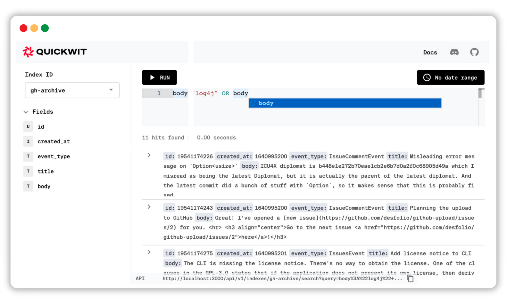

[](https://github.com/quickwit-oss/quickwit/actions?query=workflow%3ACI+branch%3Amain)
[](https://codecov.io/gh/quickwit-oss/quickwit)
[](CODE_OF_CONDUCT.md)
[](LICENCE.md)
[](https://twitter.com/Quickwit_Inc)
[](https://discord.gg/rpRRTezWhW)

<br/>

<br/>
<br/>
<p align="center">
  
  
</p>

<h3 align="center">
Search more with less
</h3>

<h4 align="center">The new way to manage your logs at any scale
</h4>
<h4 align="center">
  <a href="https://quickwit.io/docs/get-started/quickstart">Quickstart</a> |
  <a href="https://quickwit.io/docs/">Docs</a> |
  <a href="https://quickwit.io/docs/guides/tutorial-hdfs-logs">Tutorials</a> |
  <a href="https://discord.gg/rpRRTezWhW">Chat</a> |
  <a href="https://quickwit.io/docs/get-started/installation">Download</a>
</h4>
<br/>

❗**Disclaimer: you are reading the README of Quickwit 0.3 version that will be shipped in May 2022.**

Quickwit is the next-gen search & analytics engine built for log management. It is a highly reliable & cost-efficient alternative to Elasticsearch.

<br/>



<br/>

# 💡 Features

- Index data persisted on object storage
- Ingest JSON documents with or without a strict schema
- Ingest & Aggregation API Elasticsearch compatible
- Lightweight Embedded UI
- Runs on a fraction of the resources: written in Rust, powered by the mighty tantivy
- Works out of the box with sensible defaults
- Optimized for multi-tenancy. Add and scale tenants with no overhead costs
- Distributed search
- Cloud-native: Kubernetes ready
- Add and remove nodes in seconds
- Decoupled compute & storage
- Sleep like a log: all your indexed data is safely stored on object storage (AWS S3...)
- Ingest your documents with exactly-once semantics
- Kafka-native ingestion
- Search stream API that notably unlocks full-text search in ClickHouse


### 🔮 Upcoming Features
- Ingest your logs from your object storage
- Distributed indexing
- Support for tracing
- Native support for OpenTelemetry

# 🔎 Uses & Limitations
| :white_check_mark: &nbsp; When to use                                                  	| :x: &nbsp; When not to use                                       	|
|--------------------------------------------------------------	|--------------------------------------------------------------	|
| Your documents are immutable: application logs, system logs, access logs, user actions logs, audit trail  (logs), etc.                    	| Your documents are mutable.   	|
| Your data has a time component. Quickwit includes optimizations and design choices specifically related to time. | You need a low-latency search for e-commerce websites.               	|
| You want a full-text search in a multi-tenant environment.     	| You provide a public-facing search with high QPS.	|
| You want to index directly from Kafka. | You want to re-score documents at query time.
| You want to add full-text search to your ClickHouse cluster.
| You ingest a tremendous amount of logs and don't want to pay huge bills.                                                             	|
| You ingest a tremendous amount of data and you don't want to waste your precious time babysitting your cluster.

# ⚡  Getting Started


Let's download and install Quickwit.

```markdown
curl -L https://install.quickwit.io | sh
```

You can now move this executable directory wherever sensible for your environment and possibly add it to your `PATH` environment. You can also install it via [other means](https://quickwit.io/docs/get-started/installation).

Take a look at our [Quick Start]([https://quickwit.io/docs/get-started/quickstart) to do amazing things, like [Creating your first index](https://quickwit.io/docs/get-started/quickstart#create-your-first-index) or [Adding some documents](https://quickwit.io/docs/get-started/quickstart#lets-add-some-documents), or take a glance at our full [Installation guide](https://quickwit.io/docs/get-started/installation)!


# 📚 Tutorials

- [Search on logs with timestamp pruning](https://quickwit.io/docs/guides/tutorial-hdfs-logs)
- [Set up a distributed search on AWS S3](https://quickwit.io/docs/guides/tutorial-hdfs-logs-distributed-search-aws-s3)
- [Add full-text search to a well-known OLAP database, ClickHouse](https://quickwit.io/docs/guides/add-full-text-search-to-your-olap-db)

# 💬 Community

- Chat with us in [Discord][discord]
- 📝 [Blog Posts](https://quickwit.io/blog)
- 📺 [Youtube Videos](https://www.youtube.com/channel/UCvZVuRm2FiDq1_ul0mY85wA)
- Follow us on [Twitter][twitter]


# 🙋 FAQ
###  How is Quickwit different from traditional search engines like Elasticsearch or Solr?
The core difference and advantage of Quickwit is its architecture that is built from the ground up for cloud and log management. Optimized IO paths make search on object storage sub-second and thanks to the true decoupled compute and storage, search instances are stateless, it is possible to add or remove search nodes within seconds. Last but not least, we implemented a highly-reliable distributed search and exactly-once semantics during indexing so that all engineers can sleep at night. All this slashes costs for log management.

### How does Quickwit compare to Elastic in terms of cost?
We estimate that Quickwit can be up to 10x cheaper on average than Elastic. To understand how, check out our [blog post about searching the web on AWS S3](https://quickwit.io/blog/commoncrawl/).

### What license does Quickwit use?
Quickwit is open-source under the GNU Affero General Public License Version 3 - AGPLv3. Fundamentally, this means that you are free to use Quickwit for your project, as long as you don't modify Quickwit. If you do, you have to make the modifications public.
We also provide a commercial license for enterprises to provide support and a voice on our roadmap.

### What is Quickwit's business model?
Our business model relies on our commercial license. There is no plan to become SaaS in the near future.


# 🪄 Third-Party Integration
<p align="left">

 &nbsp;
 &nbsp;&nbsp;

 &nbsp; &nbsp;
 &nbsp;
 &nbsp;&nbsp;


</p>


# 🤝 Contribute and spread the word

We are always super happy to have contributions: code, documentation, issues, feedback, or even saying hello on discord! Here is how you can help us build the future of log management: 
- Have a look through GitHub issues labeled "Good first issue".
- Read our [Contributor Covenant Code of Conduct](https://github.com/quickwit-oss/quickwit/blob/0add0562f08e4edd46f5c5537e8ef457d42a508e/CODE_OF_CONDUCT.md)
- Create a fork of Quickwit and submit your pull request!

✨ And to thank you for your contributions, claim your swag by emailing us at hello at quickwit.io.


# 🔗 Reference
- [Quickwit CLI](https://quickwit.io/docs/reference/cli)
- [Index Config](https://quickwit.io/docs/reference/index-config)
- [Search API](https://quickwit.io/docs/reference/rest-api)
- [Query language](https://quickwit.io/docs/reference/query-language)
- [Code of conduct](CODE_OF_CONDUCT.md)
- [Contributing](CONTRIBUTING.md)


[website]: https://quickwit.io/
[youtube]: https://www.youtube.com/channel/UCvZVuRm2FiDq1_ul0mY85wA
[twitter]: https://twitter.com/Quickwit_Inc
[discord]: https://discord.gg/MT27AG5EVE
[blogs]: https://quickwit.io/blog

