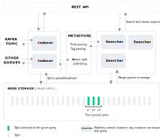

Quickwit has been designed from the ground up for cost-efficiency and scalability. 

Quickwit core relies on two processes:

- The Searchers for executing search queries from the REST API.
- The Indexers that index data from data sources.

Moreover, Quickwit leverages existing infrastructure by relying on battled-tested technologies for index storage, metadata storage, and ingestion:

### Index storage

Quickwit stores its indexes's file on Amazon S3. In a single-server deployment, this can also be your local disk. We plan to support other cloud storage, as well as HDFS.

### Metastore

Quickwit gathers index metadata into a metastore to make them available across the cluster. Indexers push index data on the index storage and publish metadata to the metastore.

In a clustered deployment, the metastore is typically a traditional RDBMS like PostgreSQL which we only support today. In a single-server deployment, it’s also possible to rely on a local file or on Amazon S3.

### Source

Quickwit supports multiple sources to ingest data from.
A source can be a simple file or a complex system like a message queue.
Additionally the indexing service will provide a zero-configuration push API.

A file is ideal for a one-time ingestion like an initial load, a message queue is ideal to continuously feed data into the system. 

Quickwit indexers connect directly to external message queues like Kafka and guarantee the exactly-once semantics. If you need support for other distributed queues, please vote for yours [here](https://github.com/quickwit-oss/quickwit/issues/1000).

## Architecture diagram

The following diagram shows a Quickwit cluster with searchers and indexers that receives queries by the API and messages from a Kafka topic.

# Key concepts

## Index & splits

A Quickwit index stores documents and makes it possible to query them efficiently. The index organizes documents into a collection of smaller independent indexes called **splits**.

A document is a collection of fields. Fields can be stored in different data structures:

- an inverted index, which enables fast full-text search.
- a columnar storage called `fast field`. It is the equivalent of doc values in [Lucene](https://lucene.apache.org/). Fast fields are required to compute aggregates over the documents matching a query. They can also allow some advanced types of filtering.
- a row-storage called the doc store. It makes it possible to get the content of the matching documents.

You can configure your index to control how to map your JSON object to a Quickwit document and, for each field, define whether it should be stored, indexed, or be a fast field. [Learn how to configure your index](../configuration/index-config.md)

### Splits

A split is a small piece of an index identified by a UUID. For each split, Quickwit adds up a `hotcache` file along with index files. This **hotcache** is what makes it possible for Searchers to open a split in less than 60ms, even on high latency storage.

The Quickwit index is aware of its splits by keeping splits metadata, notably:

- the split state which indicates if the split is ready for search
- the min/max time range computed on the timestamp field if present.

This timestamp metadata can be handy at query time. If the user specifies a time range filter to their query, Quickwit will use it to **prune irrelevant splits**.

Index metadata needs to be accessible by every instance of the cluster. This is made possible thanks to the `metastore`.

### Metastore

Quickwit gathers index metadata into a metastore to make them available across the cluster.

For a given query on a given index, a search node will ask the metastore for the index metadata and then use it to do the query planning and finally execute the plan.

Currently, Quickwit supports metastore backed by Postgresql and AWS S3 bucket. For a test/local deployment, you can also use a file backed metastore. 

### Distributed search

Quickwit's search cluster has the following characteristics:

- It is composed of stateless nodes: any node can answer any query about any splits.
- A node can distribute search workload to other nodes.
- Cluster membership is based on the SWIM gossip protocol.
- Load-balancing is made with rendezvous hashing to allow for efficient caching.

This design provides high availability while keeping the architecture simple.

**Workload distribution: root and leaf nodes**

Any search node can handle any search request. A node that receives a query will act as the root node for the span of the request. It will then process it in 3 steps:

- Get the index metadata from the metastore and identify the splits relevant to the query.
- Distributes the split workload among the nodes of the cluster. These nodes are assuming the role of leaf nodes.
- Returns aggregated results.

**Stateless nodes**

Quickwit cluster distributes search workloads while keeping nodes stateless.

Thanks to the hotcache, opening a split on Amazon S3 only takes 60ms. It makes it possible to remain totally stateless: a node does not need to know anything about the indexes. Adding or removing nodes takes seconds and does not require moving data around.

**Cluster discovery**

Quickwit uses a gossip protocol to manage membership and broadcast messages to the cluster provided by [artillery project](https://github.com/bastion-rs/artillery/). The gossip protocol is based on [SWIM: Scalable Weakly-consistent Infection-style Process Group Membership Protocol](https://www.cs.cornell.edu/projects/Quicksilver/public_pdfs/SWIM.pdf) with a few minor adaptations.

**Rendezvous hashing**

The root node uses [Rendezvous hashing](https://en.wikipedia.org/wiki/Rendezvous_hashing) to distribute the workload among leaf nodes. Rendez-vous hashing makes it possible to define a node/split affinity function with excellent stability properties when a node joins or leaves the cluster. This trick unlocks efficient caching.

### Indexing

See [dedicated indexing doc page](indexing.md).
