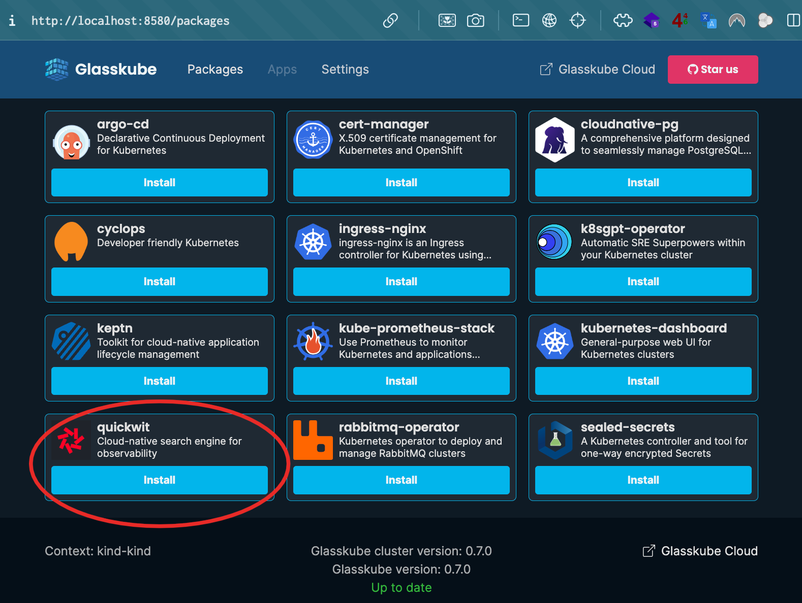

[Glasskube](https://glasskube.dev) is a package manager for Kubernetes that empowers you to effortlessly install, upgrade, configure, and manage your Kubernetes cluster packages, all while streamlining repetitive and cumbersome maintenance tasks.

## Requirements

To deploy Quickwit on Kubernetes, you will need:

- kubectl, compatible with your cluster (+/- 1 minor release from your cluster) (`kubectl version`)
- A Kubernetes cluster

1. Install `kubectl` and `glasskube` cli.

To install `kubectl` locally, you can refer to [this documentation](https://kubernetes.io/docs/tasks/tools/#install-kubectl).

To install `glasskube` cli locally, you can refer to [this documentation](https://glasskube.dev/docs/getting-started/install) and choose the right installation options according to your operating system.

For example, let's assume that you're on MacOS using homebrew and kind, this is what you'll have to do:

```shell
brew install glasskube/tap/glasskube # install the glasskube cli
kind create cluster # create a kind Kubernetes cluster
```

2. Install glasskube in your Kubernetes cluster:

```shell
glasskube bootstrap
```

3. Start and access to the Glasskube's GUI:

```shell
glasskube serve
```

You'll be able to access to the GUI of Glasskube here: http://localhost:8580

## Install Quickwit using Glasskube

`glasskube` will install Quickwit in the `quickwit` namespace. You can perform the Quickwit installation directly with the GUI:



Or use the CLI instead:

```shell
glasskube install quickwit
```

In both, you'll have to set the value of those parameters:

* `defaultIndexRootUri`: the default index URI is a S3 compliant bucket which usually looks like this: `s3://<bucket-name>/<optional-base-path>`
* `metastoreUri`: if you're not using PostgreSQL and object storage, you can pick the same bucket and value you used for the `defaultIndexRootUri` parameter
* `s3Endpoint`: the http(s) URL of your object storage service which should looks like `https://s3.{region}.{your object storage domain}`
* `s3Flavor`: which can be one of the following: `do`, `garage`, `gcp`, `minio`. You can leave it empty if your object storage is compliant with AWS S3
* `s3Region`
* `s3AccessKeyId`
* `s3SecretAccessKey`

## Uninstall quickwit

```shell
glasskube uninstall quickwit
```
