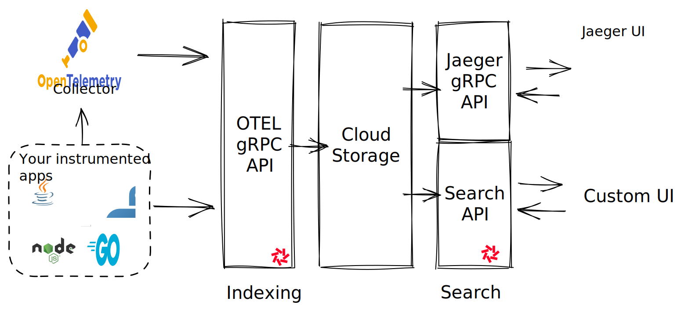

Distributed Tracing is a process that tracks your application requests flowing through your different services: frontend, backend, databases and more. It's a powerful tool to understand how your application works and to debug performance issues.

Quickwit is a cloud-native engine to index and search unstructured data which makes it a perfect fit for a traces backend.

Moreover, Quickwit supports natively the [OpenTelemetry protocol](https://opentelemetry.io/docs/reference/specification/protocol/otlp/) and the [Jaeger UI](https://www.jaegertracing.io/). **This means that you can use Quickwit to store your traces and to query them with Jaeger UI**.



## Sending traces to Quickwit

<DocCardList />

## Using Jaeger UI

Quickwit implements a gRPC service compatible with Jaeger UI. It's then possible to use Jaeger UI to visualize your traces stored in Quickwit.


## Enabling OpenTelemetry service

Quickwit natively supports the [OpenTelemetry Protocol (OTLP)](https://opentelemetry.io/docs/reference/specification/protocol/otlp/). You can use it to send your traces to Quickwit directly from your application or via an OpenTelemetry collector.

To enable Quickwit OTLP service, you can:
- Set `QW_ENABLE_OTLP_ENDPOINT` environment variable to `true` when starting Quickwit.
- Or [configure your indexer](/docs/configuration/node-config.md) by setting the indexer setting `enable_otlp_endpoint` to `true`:

```yaml title=node-config.yaml
# ... Indexer configuration ...
indexer:
    enable_otlp_endpoint: true
```

When starting Quickwit, it will start the gRPC service ready to receive spans from an OpenTelemetry collector or from your applications. If not already present, Quickwit will create automatically the index `otel-trace-v0` . Its doc mapping is described in the following [section](#opentelemetry-traces-data-model).

## Trace and span data model

A trace is a collection of spans that represents a single request. A span represents a single operation within a trace. OpenTelemetry collectors send spans, Quickwit will then indexes them in the `otel-trace-v0` index that maps OpenTelemetry spans model to an indexed document in Quickwit.

The span model is derived from the [OpenTelemetry specification](https://opentelemetry.io/docs/reference/specification/trace/api/).

Below is the doc mapping of the `otel-trace-v0` index:

```yaml

version: 0.4

index_id: otel-trace-v0

doc_mapping:
  mode: strict
  field_mappings:
    - name: trace_id
      type: text
      tokenizer: raw
      fast: true
    - name: trace_state
      type: text
      indexed: false
    - name: service_name
      type: text
      tokenizer: raw
    - name: resource_attributes
      type: json
      tokenizer: raw
    - name: resource_dropped_attributes_count
      type: u64
      indexed: false
    - name: scope_name
      type: text
      indexed: false
    - name: scope_version
      type: text
      indexed: false
    - name: scope_attributes
      type: json
      indexed: false
    - name: scope_dropped_attributes_count
      type: u64
      indexed: false
    - name: span_id
      type: text
      tokenizer: raw
    - name: span_kind
      type: u64
    - name: span_name
      type: text
      tokenizer: raw
    - name: span_fingerprint
      type: text
      tokenizer: raw
    - name: span_start_timestamp_nanos
      type: u64
      indexed: false
    - name: span_end_timestamp_nanos
      type: u64
      indexed: false
    - name: span_start_timestamp_secs
      type: datetime
      input_formats: [unix_timestamp]
      indexed: false
      fast: true
      precision: seconds
      stored: false
    - name: span_duration_millis
      type: u64
      indexed: false
      fast: true
      stored: false
    - name: span_attributes
      type: json
      tokenizer: raw
    - name: span_dropped_attributes_count
      type: u64
      indexed: false
    - name: span_dropped_events_count
      type: u64
      indexed: false
    - name: span_dropped_links_count
      type: u64
      indexed: false
    - name: span_status
      type: json
      indexed: false
    - name: parent_span_id
      type: text
      indexed: false
    - name: events
      type: array<json>
      tokenizer: raw
    - name: event_names
      type: array<text>
      tokenizer: default
      record: position
      stored: false
    - name: links
      type: array<json>
      tokenizer: raw

  timestamp_field: span_start_timestamp_secs

  partition_key: hash_mod(service_name, 100)
  tag_fields: [service_name]

indexing_settings:
  commit_timeout_secs: 30

search_settings:
  default_search_fields: []
```

## Known limitations

There are a few limitations on the current distributed tracing setup in Quickwit 0.5:
- Aggregations are not available on sparse fields and JSON field, this will be fixed in 0.6. This means that only the timestamp and `trace_id` fields can support aggregations.
- The OTLP gRPC service does not provide High-Availibility and High-Durability, this will be fixed in Q2/Q3.
- OTLP gRPC service index documents only in the `otel-trace-v0` index.
- OTLP HTTP is not available but it should be easy to add.

If you are interested in new features or discover other limitations, please open an issue on [GitHub](https://github.com/quickwit-oss/quickwit).
