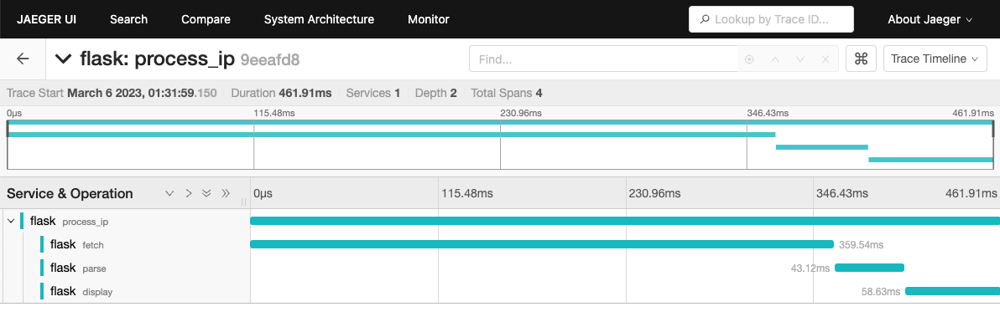
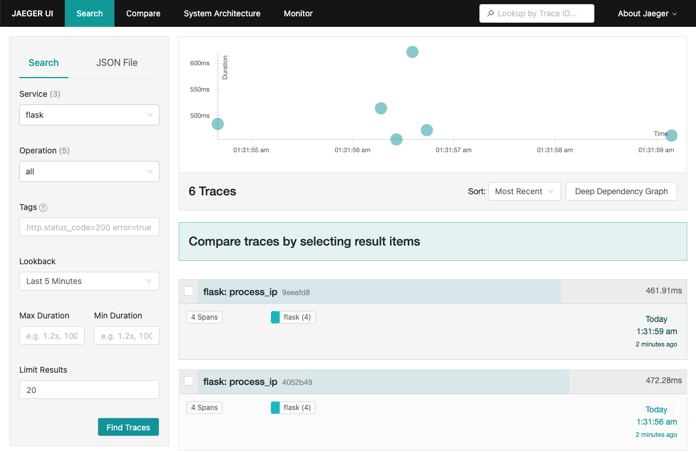

import Tabs from '@theme/Tabs';
import TabItem from '@theme/TabItem';

In this tutorial, we will show you how to instrument a Python [Flask](https://flask.palletsprojects.com/en/2.2.x/) app with OpenTelemetry and send traces to Quickwit. This tutorial was inspired by the [Python OpenTelemetry](https://opentelemetry.io/docs/instrumentation/python/getting-started/) documentation, huge thanks to the OpenTelemetry team!

## Prerequisites

- Python3 installed
- Docker installed

## Start a Quickwit instance

[Install Quickwit](/docs/get-started/installation.md) and start a Quickwit instance:

```bash
./quickwit run
```

## Start Jaeger UI

Let's start a Jaeger UI instance with docker. Here we need to inform jaeger that it should use quickwit as its backend.

Due to some idiosyncrasy associated with networking with containers, we will have to use a different approach on MacOS & Windows on one side, and Linux on the other side.

### MacOS & Windows

We can rely on `host.docker.internal` to get the docker bridge ip address, pointing to our quickwit server.

```bash
docker run --rm --name jaeger-qw \
    -e SPAN_STORAGE_TYPE=grpc-plugin \
    -e GRPC_STORAGE_SERVER=host.docker.internal:7281 \
    -p 16686:16686 \
    jaegertracing/jaeger-query:latest
```

### Linux

By default, quickwit is listening to `127.0.0.1`, and will not respond to request directed
to the docker bridge (`172.17.0.1`). There are different ways to solve this problem.
The easiest is probably to use host network mode.

```bash
docker run --rm --name jaeger-qw --network=host \
    -e SPAN_STORAGE_TYPE=grpc-plugin \
    -e GRPC_STORAGE_SERVER=127.0.0.1:7281 \
    -p 16686:16686 \
    jaegertracing/jaeger-query:latest

```

## Run a simple Flask app

We will start a flask application that is doing three things on each HTTP call `http://localhost:5000/process-ip`:

- Fetching an IP address from [https://httpbin.org/ip](https://httpbin.org/ip).
- Parsing it and fake processing it with a random sleep.
- Displaying it with a random sleep.


Let's first install the dependencies:

```bash
pip install flask
pip install opentelemetry-distro
pip install opentelemetry-exporter-otlp
```

The opentelemetry-distro package installs the API, SDK, and the opentelemetry-bootstrap and opentelemetry-instrument tools that you’ll use.

Here is the code of our app:

```python title=my_app.py
import random
import time
import requests

from flask import Flask

app = Flask(__name__)

@app.route("/process-ip")
def process_ip():
    body = fetch()
    ip = parse(body)
    display(ip)
    return ip

def fetch():
    resp = requests.get('https://httpbin.org/ip')
    body = resp.json()
    return body

def parse(body):
    # Sleep for a random amount of time to make the span more visible.
    secs = random.randint(1, 100) / 1000
    time.sleep(secs)

    return body["origin"]

def display(ip):
    # Sleep for a random amount of time to make the span more visible.
    secs = random.randint(1, 100) / 1000
    time.sleep(secs)

    message = f"Your IP address is `{ip}`."
    print(message)

if __name__ == "__main__":
    app.run(port=5000)
```

## Auto-instrumentation

OpenTelemetry provides a tool called `opentelemetry-bootstrap` that automatically instruments your Python application.

```bash
opentelemetry-bootstrap -a install
```

And that's it, we are now ready to run the app:

```bash
# We don't need metrics.
OTEL_METRICS_EXPORTER=none \
OTEL_TRACES_EXPORTER=console \
OTEL_SERVICE_NAME=my_app \
python my_app.py
```

By hitting [http://localhost:5000/process-ip](http://localhost:5000/process-ip) you should see the corresponding trace in the console.

This is nice but it would be even better if we could have the time passed in each steps, get the status code of the HTTP request, and the content type of the response. Let's do that by manually instrumentating our app!

## Manual instrumentation

```python title=my_instrumented_app.py
import random
import time
import requests

from flask import Flask

from opentelemetry import trace

# Creates a tracer from the global tracer provider
tracer = trace.get_tracer(__name__)

app = Flask(__name__)

@app.route("/process-ip")
@tracer.start_as_current_span("process_ip")
def process_ip():
    body = fetch()
    ip = parse(body)
    display(ip)
    return ip

@tracer.start_as_current_span("fetch")
def fetch():
    resp = requests.get('https://httpbin.org/ip')
    body = resp.json()

    headers = resp.headers
    current_span = trace.get_current_span()
    current_span.set_attribute("status_code", resp.status_code)
    current_span.set_attribute("content_type", headers["Content-Type"])
    current_span.set_attribute("content_length", headers["Content-Length"])

    return body

@tracer.start_as_current_span("parse")
def parse(body):
    # Sleep for a random amount of time to make the span more visible.
    secs = random.randint(1, 100) / 1000
    time.sleep(secs)

    return body["origin"]

@tracer.start_as_current_span("display")
def display(ip):
    # Sleep for a random amount of time to make the span more visible.
    secs = random.randint(1, 100) / 1000
    time.sleep(secs)

    message = f"Your IP address is `{ip}`."
    print(message)

    current_span = trace.get_current_span()
    current_span.add_event(message)

if __name__ == "__main__":
    app.run(port=5000)

```

We can now start the new instrumented app:

```bash
OTEL_METRICS_EXPORTER=none \
OTEL_TRACES_EXPORTER=console \
OTEL_SERVICE_NAME=my_app \
opentelemetry-instrument python my_instrumented_app.py
```

If you hit again [http://localhost:5000/process-ip](http://localhost:5000/process-ip), you should see new spans with name `fetch`, `parse`, and `display` and with the corresponding custom attributes!


## Sending traces to Quickwit

To send traces to Quickwit, we need to use the OTLP exporter. This is a simple as this:

```bash
OTEL_METRICS_EXPORTER=none \ # We don't need metrics
OTEL_SERVICE_NAME=my_app \
OTEL_EXPORTER_OTLP_TRACES_ENDPOINT=http://localhost:7281 \
opentelemetry-instrument python my_instrumented_app.py
```

Now, if you hit [http://localhost:5000/process-ip](http://localhost:5000/process-ip), traces will be send to Quickwit, you just need to wait around 30 seconds before they are indexed. It's time for a coffee break!

30 seconds has passed, let's query the traces from our service:

```bash
curl -XPOST http://localhost:7280/api/v1/otel-trace-v0/search -H 'Content-Type: application/json' -d '{
    "query": "resource_attributes.service.name:my_app"
}'
```

And then open the Jaeger UI [localhost:16686](http://localhost:16686/) and play with it, you have now a Jaeger UI powered by a Quickwit storage backend!





## Sending traces to your OpenTelemetry collector

Start a collector as described in the [OpenTelemetry collector tutorial](using-otel-collector.md) and execute the following command:

```bash
OTEL_METRICS_EXPORTER=none \ # We don't need metrics
OTEL_SERVICE_NAME=my_app \
opentelemetry-instrument python instrumented_app.py
```

Traces will be sent to your collector, and then to Quickwit.


## Wrap up

In this tutorial, we have seen how to instrument a Python application with OpenTelemetry and send traces to Quickwit. We have also seen how to use the Jaeger UI to analyze traces.

All the code snippets in our [tutorial repository](https://github.com/quickwit-oss/tutorials).

Please let us know what you think about this tutorial, and if you have any questions, feel free to reach out to us on [Discord](https://discord.gg/7eNYX4d) or [Twitter](https://twitter.com/quickwit_inc).
