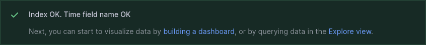
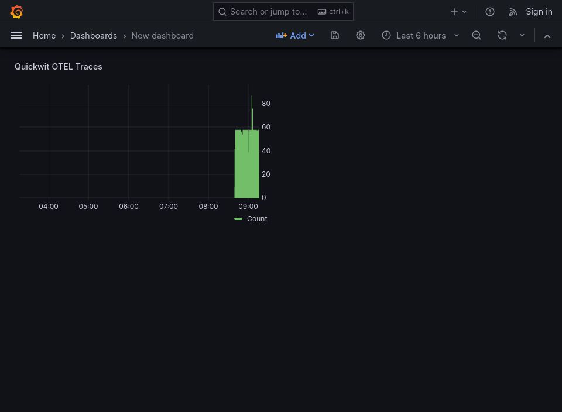

In this tutorial, we will set up a Grafana Dashboard showing Quickwit traces using Docker Compose

## Create a Docker Compose recipe

Let's add a [Quickwit instance](../installation.md) with the OTLP service enabled.

```yaml
version: '3.0'
services:
  quickwit:
    image: quickwit/quickwit
    environment:
      QW_ENABLE_OPENTELEMETRY_OTLP_EXPORTER: "true"
      OTEL_EXPORTER_OTLP_ENDPOINT: "http://localhost:7281"
    ports:
      - 7280:7280
    command: ["run"]
```

Then we create a [Grafana](https://grafana.com/docs/grafana/latest/setup-grafana/installation/docker/#run-grafana-via-docker-compose) service with the [Quickwit Datasource](https://github.com/quickwit-oss/quickwit-datasource) plugin.

```yaml
  grafana:
    image: grafana/grafana-oss
    container_name: grafana
    ports:
      - "${MAP_HOST_GRAFANA:-127.0.0.1}:3000:3000"
    environment:
      GF_INSTALL_PLUGINS: https://github.com/quickwit-oss/quickwit-datasource/releases/download/v0.3.0-beta.0/quickwit-quickwit-datasource-0.3.0-beta.0.zip;quickwit-quickwit-datasource
      GF_AUTH_DISABLE_LOGIN_FORM: "true"
      GF_AUTH_ANONYMOUS_ENABLED: "true"
      GF_AUTH_ANONYMOUS_ORG_ROLE: Admin
```

Save and run the recipe:

```bash
$ docker compose up
```

You should be able to access Quickwit'UI on `http://localhost:7280/` and Grafana's UI on `http://localhost:3000/`.

## Setting up the datasource

In Grafana, head to [Data Sources](http://localhost:3000/connections/datasources). If the plugin is installed correctly you should be able to find Quickwit in the list.

We're going to set up a new Quickwit data source lookig at Quickwit's own OpenTelemetry traces, configure the datasource with the following parameters:

- URL : `http://quickwit:7280/api/v1/` _This uses the docker service name as the host_
- Index ID : `otel-traces-v0_6`
- Timestamp field : `span_start_timestamp_nanos`
- Timestamp output format : `unix_timestamp_nanos`

Save and test, you should obtain a confirmation that the datasource is correctly set up.




## Creating a dashboard

Then [create a new dashboard](http://localhost:3000/dashboard/new) and add a visualization : you should be able to choose your new quickwit datasource here.

Quickwit sends itself its own traces, so we should already have data. Configure your panel to taste and apply to see Quickwit in Grafana ! 


