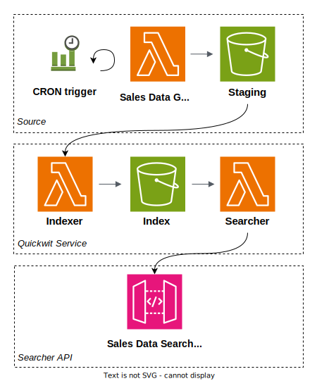

In this tutorial, we’ll show you how to run Quickwit on Lambda on a complete use case. We’ll present you the associated cloud resources, a cost estimate and how to deploy the whole stack using AWS CDK.

## The use case
Let’s start with the functional description of what our stack will be doing.

The current setup to which we want to add search is composed by the following pieces:
- An application that generates sales data and uploads it in batches to S3. To avoid dragging around a third party application in this tutorial stack, we have hacked together a small Lambda function to simulate the application by generating random data.
- Our users want to search the ingested data through an HTTP API authenticated with an API Key. For them, the search is just a service that can be called from their applications backends. We expect a relatively low volume of queries on average, a few thousands per day. But we know that client applications are likely to have usage spikes that will focus queries to our search API on short time intervals, e.g start of the business hours, end of a sales cycle…

## The cloud resources
Here is a simplified drawing of our example stack:



Let’s break it down piece by piece.

### The Source

For the sake of the example, the source is based on a data generator that also runs on Lambda. It is triggered every 5 minutes by an [AWS EventBridge Scheduled Rule](https://aws.amazon.com/blogs/compute/introducing-amazon-eventbridge-scheduler/) and pushes its output to a Staging bucket. The data itself has a very simple structure that can be summarized by the following [doc mapping](https://quickwit.io/docs/configuration/index-config):
```
index_id: mock-sales

doc_mapping:
  field_mappings:
    - name: ts
      type: datetime
      input_formats:
        - unix_timestamp
      output_format: unix_timestamp_millis
      precision: milliseconds
      fast: true
    - name: id
      type: u64
    - name: name
      type: text
      tokenizer: raw
    - name: price
      type: f64
    - name: quantity
      type: u64
    - name: description
      type: text
      tokenizer: default
  timestamp_field: ts
```

It is the Staging bucket that is configured to send the notification that triggers the Indexer Lambda each time an object is created by the Sales Data Generator.

### The Quickwit Service

The Quickwit Service in the middle is the base building block. It contains the necessary infrastructure to build and query a Quickwit index. It is composed of three main resources: the Indexer Lambda, the Index Bucket and the Searcher Lambda:
- The Indexer is an AWS Lambda function that can be invoked to load a JSON line delimited file from S3 and index it. It writes the generated index splits and associated metadata to the Index Bucket. Due to [current limitations with the file based metastore](https://quickwit.io/docs/configuration/metastore-config), its reserved concurrency configuration is set to 1 to guarantee that only 1 indexer will write to the metastore file at any given time. 
- The Searcher Lambda does not have this limitation and multiple queries can be run in parallel. Note nevertheless that the Searcher is capable of leveraging a cache across consecutive invocations, compared to parallel queries which will end up being executed on different Lambda containers. So running queries sequentially will likely reduce their aggregated running duration as well as the total number of reads from S3.

### The Searcher API

The Searcher API uses AWS API Gateway [REST API](https://docs.aws.amazon.com/apigateway/latest/developerguide/http-api-vs-rest.html), a managed service with a [usage based pricing](https://aws.amazon.com/api-gateway/pricing/). This is perfect for our use case with a low volume of requests.

Our example contains a simplified configuration that mimics the search endpoint of the [Quickwit REST API](https://quickwit.io/docs/reference/rest-api). The generated URL follows the pattern:
```
https://{api_id}.execute-api.{region}.amazonaws.com/api/v1/mock-sales/search
```

The endpoint is protected by an API key that you configure when deploying the stack.

## Cost estimates

Before running a system in the Cloud, it is always a good idea to get a rough estimate of the associated costs. This example stack is generating, indexing and storing a hundred thousand events every few minutes. We consider the [current pricing](https://aws.amazon.com/lambda/pricing/) in the region us-east-1 of $0.00005 per second for our 3GB RAM Lambda functions. With a few back-of-the-envelope calculations, we get the following estimates:
- The leading cost is the Indexer Lambda running duration. You might expect an associated cost in the order of $0.1 per day (300 executions of 5 seconds each)
- Objects in the staging area expire after 1 day, so you will never have more than 10GB stored there ($0.2 per month)
- Approximately 1GB of index is created per day. As data accumulates, storage becomes more and more expensive. A months’ worth of historical data (30GB) costs around $0.7 per month.
- The cost of the searches will likely remain negligible. Usually search queries take less than 1 second, so you can run in the order of 10k of them with a budget of $1. A client that has an auto refresh mechanism enabled might quickly reach this amount of queries, but in that case the results will likely be served from the Searcher Lambda cache, which means the query should be resolved in less than 100ms. In practice, for systems that perform mostly identical queries, we expect the number of queries that can be performed with $1 to be 100k or more. More on this in our upcomming blog post about search performances.

## Deployment

### Prerequisites

We use [AWS CDK](https://aws.amazon.com/cdk/) for our infrastructure automation script. Install it using [npm](https://docs.npmjs.com/downloading-and-installing-node-js-and-npm):
```bash
npm install -g aws-cdk 
```
We also use the `curl` and `make` commands. For instance on Debian based distributions:
```bash
sudo apt update && sudo apt install curl make
```

You also need AWS credentials to be properly configured in your shell. One way is using the [credentials file](https://docs.aws.amazon.com/cli/latest/userguide/cli-configure-files.html).

Finally, clone the Quickwit repository:
```bash
git clone https://github.com/quickwit-oss/quickwit.git
cd quickwit/distribution/lambda
```
### Deploy
Configure the AWS region and [account id](https://docs.aws.amazon.com/IAM/latest/UserGuide/console_account-alias.html) where you want to deploy the example stack:
```bash
export CDK_ACCOUNT=123456789
export CDK_REGION=us-east-1
```

If this region/account pair was not bootstrapped by CDK yet, run:
```bash
make bootstrap
```

This initializes some basic resources to host artifacts such as Lambda packages.

Everything is ready! You can finally deploy the stack:
```bash
export SEARCHER_API_KEY=my-at-least-20-char-long-key 
make deploy-mock-data
```

If you don’t set `SEARCHER_API_KEY`, the Searcher API deployment is skipped.

:::warning
The API key is stored in plain text in the CDK stack. For a real world deployment, the key should be fetched from something like [AWS Secrets Manager](https://docs.aws.amazon.com/cdk/v2/guide/get_secrets_manager_value.html).
:::

### Query

Once the CDK deployment is completed, your example stack is up and running. The Sales Data Generator Lambda is going to be triggered every 5 minutes, which in turn will trigger the Indexer Lambda. 

Around the end of the deployment logs, you’ll see a list of outputs. One of them is the URL of the search endpoint. Here is an example request using `curl`:
```bash
curl -d '{"query":"quantity:>5", "max_hits": 10}' \
    -H "Content-Type: application/json" \
    -H "x-api-key: my-at-least-20-char-long-key" \
    -X POST \
    https://{api_id}.execute-api.{region}.amazonaws.com/api/v1/mock-sales/search \
    --compressed
```

The index is not created until the first run of the Indexer, so you might need a few minutes before your first search request succeeds. The API Gateway key configuration also takes a minute or two to propagate, so the first requests might receive an authorization error response.

Because the JSON query responses are often quite verbose, the Searcher Lambda always compresses them before sending them on the wire. It is crucial to keep this size low, both to avoid hitting the Lambda payload size limit of 6MB and to avoid egress costs at around $0.10/GB. We do this regardless of the `accept-encoding` request header, this is why the `--compressed` flag needs to be set to `curl`.

### Cleaning up

Once you're done playing with the example stack, it is strongly recommended to delete the associated resources. In the shell where `CDK_ACCOUNT`, `CDK_REGION` and your AWS credentials are configured, run:
```bash
make destroy-mock-data
```

If you don’t want to tear down the infrastructure but want to make the costs associated with the stack negligible, you can just stop the source data generator. To do so, open the AWS Console, find the Sales Data Generator Lambda (it should be called something like `MockDataStack-SourceMockDataGenerator{some_random_id}`), and disable its EventBridge scheduled trigger. Without any data generated, the Indexer Lambda is not triggered either. You only pay a small fee for the S3 storage and the eventual queries you make on the dataset (both might even stay within your [free tier](https://aws.amazon.com/free/) if it isn’t already consumed by another application).

## Alternative use cases

### Firehose as a source

A very common way to land data on S3 is using AWS Firehose. It serves as a buffer between data sources that emit one or a few events at a time and S3 where manipulating small objects is often inefficient.

### Querying without the API Gateway

API Gateway has the benefit of exposing the Lambda function as an HTTP Endpoint with custom authentication. When calling the Searcher directly from an AWS resource, such as another Lambda function or an EC2 instance, it might actually be simpler to call directly the AWS Lambda [invoke API](https://docs.aws.amazon.com/lambda/latest/dg/API_Invoke.html) using an AWS SDK (e.g boto3 for Python). This leverages the AWS IAM roles for authentication and avoids the intermediate API Gateway layer. 

## Possible improvements
Quickwit Lambda is still in beta and some features might still be added to improve it:
- The current indexer does not clean up the splits that are marked for deletion after a merge.
- The file source does not currently support reading compressed files from the source bucket. More generally, the file source could be made more flexible to support more data formats natively.

If you are interested in any of these features or other ones, join us on [Discord](https://discord.com/channels/908281611840282624/) and share your use cases with us!
