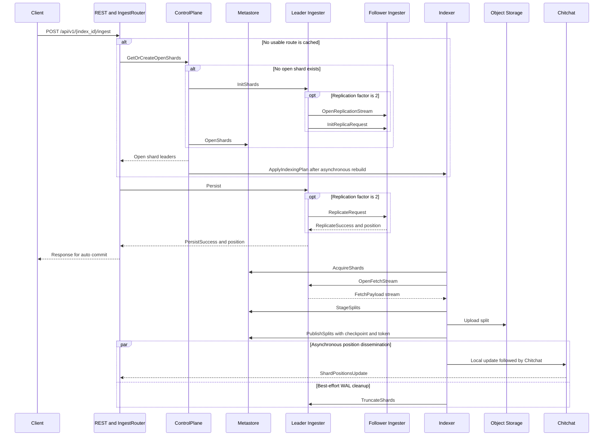

# Ingest V2 write path

This document explains how a document travels through Quickwit from the native ingest REST API to a searchable split. It focuses on Ingest V2, the default ingest implementation, and on the Tantivy pipeline used for logs and traces.

The ingest path has two connected but independently scheduled flows:

- The **request path** routes documents to an ingester and appends them to a write-ahead log (WAL).
- The **indexing path** consumes WAL records, builds splits, uploads them, and atomically publishes their metadata and WAL checkpoints.

The WAL decouples these flows. An ingester can accept documents before an indexing pipeline has started, and indexing can continue after the original HTTP request has returned.

## Overview

The native endpoint is `POST /api/v1/{index_id}/ingest`.

At a high level, a request follows this path:

```text
HTTP request
  -> local IngestRouter
  -> leader Ingester
  -> optional follower Ingester
  -> per-shard logical WAL queue
  -> assigned Indexer
  -> Tantivy split
  -> object storage
  -> metastore publication
  -> WAL truncation
```



## Service placement and transport

Every Quickwit node constructs an `IngestRouter`, so the node receiving an HTTP request can route it without first forwarding the whole request to a dedicated router node.

Nodes with the `indexer` role currently host both:

- the `IngesterService`, which owns the local WAL;
- the `IndexingService`, which runs indexing pipelines.

Quickwit uses typed service clients for internal calls. When caller and callee are colocated, the call can use Tower or an actor mailbox without crossing the network. When they are on different nodes, the same service interface uses tonic gRPC. The logical RPC names in this document therefore describe service boundaries, but not every call necessarily becomes a network request.

## 1. REST request construction

The REST handler parses the NDJSON body and builds an `IngestRequestV2`. For the native endpoint, the request contains one subrequest:

```text
IngestRequestV2 {
    commit_type: Auto,
    subrequests: [{
        subrequest_id: 0,
        index_id: "some-index",
        source_id: "_ingest-source",
        doc_batch: ...,
    }],
}
```

Each input document receives a `DocUid`. The UID associates synchronous parse failures with the original document, but the current WAL record format does not retain it for deduplication.

The handler invokes the node-local `IngestRouterService.Ingest` implementation. Elasticsearch bulk and OTLP ingestion build different frontend requests, but ultimately converge on the same Ingest V2 router and reserved `_ingest-source`.

Code: [REST ingest handler](../../quickwit/quickwit-serve/src/ingest_api/rest_handler.rs), [router protobuf](../../quickwit/quickwit-proto/protos/quickwit/router.proto).

## 2. Selecting an ingester

The router maintains an in-memory table keyed by `(index_id, source_id)`. For each candidate leader, it tracks:

- the `IndexUid`, including the index incarnation;
- the ingester node ID;
- a WAL capacity score;
- the number of open shards for the source;
- readiness and availability-zone information.

The `IndexUid` prevents a deleted and recreated index from receiving writes intended for an older incarnation with the same `index_id`.

The current router selects an **ingester node**, not an exact shard. It:

1. Prefers eligible nodes in the router's availability zone.
2. Samples two candidates when several are available.
3. Prefers the candidate with the higher capacity score.
4. Breaks ties using the number of open shards.
5. Excludes nodes that are unready, unavailable, full, or have no open shard.

The table is initially seeded from the control plane. It is subsequently refreshed using:

- capacity and open-shard-count updates disseminated through Chitchat;
- routing updates piggybacked on `PersistResponse`;
- new control-plane responses after failures or topology changes.

Code: [router](../../quickwit/quickwit-ingest/src/ingest_v2/router.rs), [routing table](../../quickwit/quickwit-ingest/src/ingest_v2/routing_table.rs), [capacity broadcast](../../quickwit/quickwit-ingest/src/ingest_v2/broadcast/capacity_score.rs).

## 3. Resolving or creating shards

If the router has never synchronized this `(index, source)` pair, or no candidate is currently usable, it calls:

```text
IngestRouter -> ControlPlaneService.GetOrCreateOpenShards
```

The request can also report closed shards and leaders that failed during earlier attempts.

The control plane normally answers from its in-memory model. That model is populated from the metastore at startup and maintained as index, source, and shard topology changes occur.

If no usable open shard exists, the control plane:

1. Determines the configured minimum number of shards.
2. Selects ready ingesters based on their current shard load.
3. Assigns a leader and, for replication factor 2, a distinct follower.
4. Creates a ULID shard ID.
5. Calls `IngesterService.InitShards` on the leader.
6. Calls `MetastoreService.OpenShards` only for successfully initialized shards.
7. Inserts the returned shards into its model.
8. Returns the available shards to the router.
9. Schedules an indexing-plan rebuild.

The initialization-before-registration order prevents the metastore from advertising a shard that was never successfully created on its ingester. A reconciliation path cleans up queues left behind by ambiguous failures.

### Leader and follower initialization

The leader creates a logical WAL queue named:

```text
<index_uid>/<source_id>/<shard_id>
```

For replication factor 2, the leader opens or reuses one bidirectional `OpenReplicationStream` for the leader-follower pair and sends an `InitReplicaRequest`. The follower creates the corresponding replica queue.

Replication factor defaults to 1 and supports values 1 and 2.

Code: [ingest controller](../../quickwit/quickwit-control-plane/src/ingest/ingest_controller.rs), [ingester shard initialization](../../quickwit/quickwit-ingest/src/ingest_v2/ingester.rs), [replication](../../quickwit/quickwit-ingest/src/ingest_v2/replication.rs).

## 4. Persisting documents

Once it has a candidate leader, the router calls:

```text
IngestRouter -> IngesterService.Persist
```

A `PersistSubrequest` contains an `index_uid`, source ID, and document batch, but no shard ID. The selected ingester chooses the open shard for that `(index_uid, source_id)` with the most remaining per-shard rate-limit capacity.

For each subrequest, the ingester:

1. Verifies that the request names this node as leader.
2. Verifies that the node is accepting writes.
3. Selects an open shard.
4. Checks the configured WAL disk and memory limits.
5. Acquires per-shard throughput permits.
6. Optionally validates the documents against the shard's document mapping.
7. Removes invalid documents and records their `ParseFailure`s.
8. Replicates the remaining batch if replication factor is 2.
9. Appends the batch to its local WAL queue.
10. Returns the resulting inclusive position in `PersistSuccess`.

When a source has a transform, synchronous validation is disabled at this stage because validation must occur after the indexing pipeline applies the transform.

If all documents are invalid, the subrequest can succeed with zero persisted documents and an unchanged position. This lets the REST response report rejected documents without writing them to the WAL.

### Follower-first synchronous replication

With replication factor 2, the write order is:

```text
leader
  -> follower ReplicateRequest
  -> follower WAL append
  <- follower ReplicateSuccess(position)
  -> leader WAL append
  -> verify leader position equals follower position
  <- PersistSuccess(position)
```

Code: [persist implementation](../../quickwit/quickwit-ingest/src/ingest_v2/ingester.rs), [ingester protobuf](../../quickwit/quickwit-proto/protos/quickwit/ingester.proto).

## 5. WAL representation and acknowledgement

Quickwit uses `mrecordlog`, a multiplexed WAL containing multiple logical per-shard queues. It does not create one independent WAL file for every shard.

Each valid document becomes:

```text
MRecord::Doc(raw_document_bytes)
```

For a non-empty valid batch, a request using `commit=force` adds one record after the documents:

```text
MRecord::Commit
```

Positions are per-shard and per-record. A forced batch containing `N` valid documents therefore advances the shard position by `N + 1`. If validation rejects the entire batch, nothing is appended and the position remains unchanged.

The current writer emits the version 0 record format:

```text
byte 0: record header version
byte 1: record type, Doc or Commit
remaining bytes: raw document payload for Doc
```

### Meaning of `PersistSuccess`

When at least one valid document remains, success for replication factor 1 means the leader appended the batch to its WAL. For replication factor 2, it means the follower append succeeded and was acknowledged before the leader append succeeded. If validation rejects the entire batch, success instead reports the failures and an unchanged position without replication or a WAL append.

It does **not** mean that either copy was synchronously fsynced. Production opens `mrecordlog` with a delayed five-second `Flush` policy. `Flush` moves userspace-buffered data to the operating system but does not request an `fsync`, and the delayed policy is evaluated by WAL operations rather than by an independent timer.

`commit=force` changes the logical indexing boundary. It does not strengthen the WAL's disk-flush semantics.

Code: [mrecord encoding](../../quickwit/quickwit-ingest/src/ingest_v2/mrecord.rs), [WAL append](../../quickwit/quickwit-ingest/src/ingest_v2/mrecordlog_utils.rs), [WAL initialization](../../quickwit/quickwit-ingest/src/ingest_v2/state.rs).

## 6. Scheduling an indexing pipeline

The control plane converts its source and shard model into `IndexingTask`s:

```text
IndexingTask {
    index_uid,
    source_id,
    pipeline_uid,
    shard_ids,
    params_fingerprint,
}
```

The scheduler balances estimated CPU load while preferring an indexer that already hosts the shard's leader or follower. It calls:

```text
ControlPlane -> IndexingService.ApplyIndexingPlan
```

The indexing service compares the desired plan with its running pipelines, stops obsolete pipelines, starts missing pipelines, and sends shard assignments to the corresponding `IngestSource` actors.

This work is asynchronous relative to the original ingest request. New writes can accumulate in the WAL while the control plane rebuilds and applies the plan.

Code: [indexing scheduler](../../quickwit/quickwit-control-plane/src/indexing_scheduler/mod.rs), [physical scheduling](../../quickwit/quickwit-control-plane/src/indexing_scheduler/scheduling/mod.rs), [indexing service](../../quickwit/quickwit-indexing/src/actors/indexing_service.rs).

## 7. Acquiring and fetching shards

Before reading an assigned shard, `IngestSource` calls:

```text
Indexer -> MetastoreService.AcquireShards
```

The metastore writes a new `publish_token` to each acquired shard and returns:

- the canonical `publish_position_inclusive`;
- the leader ID;
- the optional follower ID;
- the current shard state.

The publish token is a fencing token, not a renewable lease. A new owner overwrites the token. A previous owner can finish local work, but the metastore rejects any later publication carrying its stale token.

For every acquired shard that has not reached EOF, the source opens:

```text
Indexer -> IngesterService.OpenFetchStream
```

The request starts strictly after the metastore's published position. This makes the metastore checkpoint the authoritative recovery position, rather than the indexer's last in-memory read position.

The fetch client:

1. Prefers a local leader or follower when available.
2. Otherwise selects one of the two copies.
3. Retries transport and stream failures.
4. Fails over to the other copy and resumes from the last delivered position.

A `ShardNotFound` response is treated as terminal rather than triggering replica failover.

The ingester sends `FetchPayload`s containing raw mrecords and exact `(from, to]` positions. When the consumer catches up on an open shard, the fetch task waits for a shard-status notification instead of polling. A closed shard emits `FetchEof` only after all records through its replication position have been drained.

Code: [ingest source](../../quickwit/quickwit-indexing/src/source/ingest/mod.rs), [fetch streams](../../quickwit/quickwit-ingest/src/ingest_v2/fetch.rs), [shard acquire protobuf](../../quickwit/quickwit-proto/protos/quickwit/metastore.proto).

## 8. Building and uploading a split

For the Tantivy logs and traces path, records flow through this actor chain:

```text
IngestSource
  -> DocProcessor
  -> Indexer
  -> IndexSerializer
  -> Packager
  -> Uploader
  -> Sequencer
  -> Publisher
```

`IngestSource` decodes each mrecord:

- `MRecord::Doc` adds a raw document to the batch.
- `MRecord::Commit` requests a forced pipeline commit.

At the same time, it constructs a source checkpoint delta for each shard. Deltas use `(from, to]` semantics.

The downstream actors:

- apply transforms and document mappings;
- parse JSON and extract mapped fields;
- group documents into partitions;
- build Tantivy segments;
- serialize and package splits with their hotcaches.

Documents rejected at this stage are omitted from the split, but their WAL positions remain in the checkpoint delta. This prevents a poison document from being retried indefinitely.

The Indexer accumulates documents and checkpoint deltas in an indexing workbench. It finalizes the workbench and sends its splits downstream because of one of several triggers, including:

- the configured commit timeout;
- the indexing heap-memory limit;
- the target document count;
- a force-commit marker;
- source completion or cooperative draining.

If all documents in a range are rejected, the pipeline can publish an empty checkpoint update without a data split.

### Stage before upload

For a non-empty split, the uploader performs:

1. `MetastoreService.StageSplits`
2. Upload of the split payload to object storage
3. Forwarding of the resulting update to the sequencer and publisher

A staged split is not searchable. Registering it first lets maintenance code identify and remove abandoned staged metadata and uploaded objects after failures.

Uploads may run concurrently. The sequencer restores publication order so checkpoint deltas for a shard remain contiguous.

Code: [indexing pipeline](../../quickwit/quickwit-indexing/src/actors/indexing_pipeline.rs), [uploader](../../quickwit/quickwit-indexing/src/actors/uploader.rs), [sequencer](../../quickwit/quickwit-indexing/src/actors/sequencer.rs).

## 9. Publishing the split and checkpoint

The publisher calls:

```text
Indexer -> MetastoreService.PublishSplits
```

The request contains:

- staged split IDs;
- replaced split IDs, if any;
- the serialized checkpoint delta;
- the pipeline's publish token.

For the PostgreSQL metastore, one transaction:

1. Locks every referenced shard row.
2. Verifies that every row contains the request's publish token.
3. Verifies that the checkpoint delta begins at the current published positions.
4. Advances each shard's `publish_position_inclusive`.
5. Moves new splits from `Staged` to `Published`.
6. Moves replaced splits from `Published` to `MarkedForDeletion`.
7. Commits the shard positions and split states atomically.

`PublishSplits`, not the WAL append or object-store upload, is the indexing commit and search-visibility boundary.

### Recovery around publication

If an indexer fails before `PublishSplits`, the canonical shard position does not move. A new owner acquires the shard and re-reads the same WAL range. Any staged or uploaded split remains non-searchable and can be garbage-collected.

If it fails after `PublishSplits`, the split and checkpoint have both been committed. The next owner starts after the published position and does not re-index that range.

This transaction provides atomic publication of a WAL range. It does not make client ingestion end-to-end exactly once: an ambiguous `Persist` timeout followed by a client or router retry can append the documents again.

Code: [logs publisher](../../quickwit/quickwit-indexing/src/actors/log_publisher_impl.rs), [PostgreSQL publication](../../quickwit/quickwit-metastore/src/metastore/postgres/metastore.rs).

## 10. Truncating the WAL

Only after `PublishSplits` succeeds does the publisher send `SuggestTruncate` to the source.

`IngestSource` then starts two independent follow-ups:

- It emits a local published-position update. `ShardPositionsService` consumes the event asynchronously and disseminates the position cluster-wide through Chitchat.
- It spawns best-effort `IngesterService.TruncateShards` calls to the leader and follower, allowing each WAL copy to discard records through the published position.

There is no guaranteed ordering between Chitchat dissemination and the direct truncation RPCs.

A failed truncation wastes WAL capacity but does not lose acknowledged data, because the metastore checkpoint remains the source of truth and truncation happens only after publication.

### Closing and deleting a shard

When a shard is closed, the fetch stream drains it and emits an EOF position. The pipeline publishes that EOF through the same checkpoint transaction. Chitchat then carries the EOF to the other services:

- ingesters delete the local WAL queues;
- the control plane calls `MetastoreService.DeleteShards`;
- the control plane removes the shard from its model;
- the indexing plan is rebuilt without the completed shard.

The direct `TruncateShards` RPC deliberately does not delete a queue on EOF. Deletion is driven by the shared published-position signal so the control plane, metastore, and ingesters converge on the same lifecycle event.

Code: [published-position service](../../quickwit/quickwit-indexing/src/models/shard_positions.rs), [control-plane EOF handling](../../quickwit/quickwit-control-plane/src/control_plane.rs).

## Commit modes

| Mode | WAL behavior | Response condition |
|---|---|---|
| `auto` | Appends documents without a commit marker. | Returns after `PersistSuccess`. The documents may not yet be searchable. |
| `wait_for` | Same WAL records as `auto`. | Waits until a normal publication covers the returned WAL position. |
| `force` | For a non-empty valid batch, appends an `MRecord::Commit` after the documents. | Forces the indexing pipeline to finalize its current workbench, then waits for publication. |

Both `wait_for` and `force` create a router-side publish tracker before persistence starts. The tracker waits for cluster `ShardPositionsUpdate` events to reach every returned WAL position. It does not poll the metastore.

`force` can produce many small splits and should not be treated as the normal high-throughput mode.

## Internal RPC summary

| Caller | Callee | RPC | When it is used |
|---|---|---|---|
| Ingest router | Control plane | `GetOrCreateOpenShards` | Initial synchronization, no capacity, or routing failures |
| Control plane | Leader ingester | `InitShards` | Shard creation |
| Leader ingester | Follower ingester | `OpenReplicationStream` | Long-lived stream when replication factor is 2 |
| Ingest router | Leader ingester | `Persist` | Every ingest batch |
| Control plane | Metastore | `OpenShards` | Durable shard registration |
| Control plane | Indexer | `ApplyIndexingPlan` | Topology or configuration changes |
| Indexer | Metastore | `IndexesMetadata` | Pipeline startup and configuration loading |
| Indexer | Metastore | `AcquireShards` | Assignment or reassignment fencing |
| Indexer | Ingester | `OpenFetchStream` | Long-lived WAL stream for an assigned shard |
| Indexer | Metastore | `StageSplits` | Registration of generated split metadata |
| Indexer | Metastore | `PublishSplits` | Atomic split and checkpoint commit |
| Indexer | Leader and follower | `TruncateShards` | Best-effort cleanup after publication |
| Control plane | Metastore | `DeleteShards` | Cleanup after a published EOF |

There is no direct ingester-to-metastore call on the normal write path.

## Chitchat coordination

Not all coordination uses gRPC. Quickwit disseminates several eventually consistent signals through Chitchat:

- ingester readiness;
- WAL capacity scores and per-source open-shard counts;
- primary-shard state and ingestion rates;
- indexers' currently running indexing tasks;
- published shard positions and EOF markers.

These signals keep the routing table current, let the control plane verify its desired indexing plan, drive shard scaling, wake commit waiters, and coordinate WAL cleanup. Durable ownership and publication state remain in the metastore.

## Failure and retry semantics

- The router retries transient persist failures up to five times. Within the request, it avoids leaders after transport or node-unavailable errors, WAL-full responses, and timeouts; `NoShardsAvailable` instead relies on the response's refreshed routing information.
- WAL-full and load-shedding conditions are reported as rate limiting, allowing clients to back off.
- A server-side `Persist` operation continues independently if its caller times out, protecting WAL invariants from cancellation.
- Persist retries are not idempotent at the WAL layer. A request that times out after being appended can be appended again.
- The publish token prevents a reassigned, stale indexing pipeline from committing its output.
- Atomic split and checkpoint publication makes indexing restartable without scanning previously published splits.

The resulting contract is best described as WAL buffering plus fenced, atomic indexing publication, not end-to-end exactly-once delivery.
