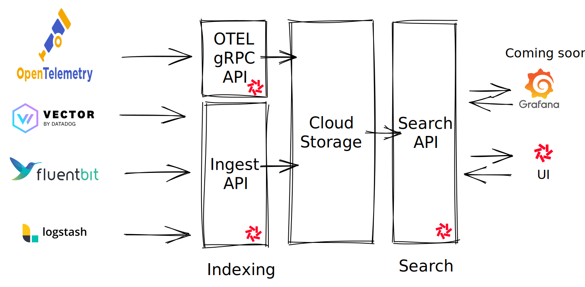

Quickwit is built from the ground up to [index efficiently unstructured data](../guides/schemaless.md), and search directly your data sitting on cloud storage. **This makes Quickwit a perfect fit for logs!**

Moreover, Quickwit is OpenTelemetry native and provides a REST API ready to ingest any JSON formatted logs, this makes Quickwit well integrated in the observability ecosystem.



## Learn how to manage your logs with Quickwit

- [Supported agents](#supported-agents): OpenTelemetry, Vector, Fluentbit and more.
- [Enabling OpenTelemetry service](#opentelemetry-service)
- Tutorials
  - [Sending logs from Vector](./send-logs-from-vector-to-quickwit.md)
  - [Sending logs from Fluentbit](./send-logs-from-vector-to-quickwit.md)
  - [Sending Kubernetes logs with OTEL collectors](./deploy-quickwit-otel-with-helm.md)
  - More soon!
- [Logs data model](#logs-data-model)
- [UI Integration](#ui-integration)
- [Limitations](#limitations)


## Supported agents

### OpenTelemetry agent

Before using an [OpenTelemety collector](https://opentelemetry.io/docs/collector/), you need to enable [Quickwit OpenTelemetry service](#opentelemetry-service).
Once started, Quickwit is ready to receive OpenTelemetry gRPC requests.

To configure an OpenTelemetry agent, here is a typical configuration file to send logs to Quickwit:

```yaml
mode: daemonset
presets:
  logsCollection:
    enabled: true
  kubernetesAttributes:
    enabled: true
config:
  exporters:
    otlp:
      # Kubernetes endpoint as here or directly to your local instance localhost:7281
      endpoint: quickwit-indexer.qw-tutorial.svc.cluster.local:7281
      # Quickwit OTEL gRPC endpoint does not support compression yet.
      compression: none
      tls:
        insecure: true
  service:
    pipelines:
      logs:
        exporters:
          - otlp
```

Find more configuration details on the [OpenTelemetry documentation](https://opentelemetry.io/docs/collector/configuration/).

### HTTP-based agents

It's also possible to use other agents that send HTTP requests to Quickwit Ingest API. Quickwit also partially supports Elasticseardch `_bulk` API. Thus, there is a good chance that your agent is already compatible with Quickwit.
Currently, we have tested the following HTTP-based agents:

- [Vector](./send-logs-from-vector-to-quickwit.md)
- [Fluentbit](./send-logs-from-fluentbit-to-quickwit.md)
- FluentD (tutorial coming soon)
- Logstash: Quickwit does not support the Elasticsearch output. However, it's possible to send logs with the HTTP output but with `json` [format](https://www.elastic.co/guide/en/logstash/current/plugins-outputs-http.html) only.

## OpenTelemetry service

Quickwit natively supports the [OpenTelemetry Protocol (OTLP)](https://opentelemetry.io/docs/reference/specification/protocol/otlp/).

To enable Quickwit OTLP service, you need to [configure your indexer](/docs/configuration/node-config.md) by setting the indexer setting `enable_otlp_endpoint` to `true`:

```yaml title=node-config.yaml
# ... Indexer configuration ...
indexer:
    enable_otlp_endpoint: true
```

When starting Quickwit, it will start the gRPC service ready to receive logs from an OpenTelemetry collector. If not already present, Quickwit will create automatically the index `otel-logs-v0` . Its doc mapping is described in the following [section](#opentelemetry-logs-data-model).

You can also send your logs to this index by using the [ingest API](/docs/reference/rest-api.md#ingest-data-into-an-index).

In 0.5, Quickwit does not start an OTLP HTTP service, if you need it, please [open an issue](https://github.com/quickwit-oss/quickwit).

## OpenTelemetry logs data model

The logs data model is derived from the [OpenTelemetry logs data model](https://opentelemetry.io/docs/reference/specification/logs/data-model/).

Below is the index configuration of the `otel-logs-v0` index that maps OpenTelemetry logs to an indexed document in Quickwit. 

```yaml

version: 0.4

index_id: otel-logs-v0

doc_mapping:
  mode: strict
  field_mappings:
    - name: timestamp_secs
      type: datetime
      input_formats: [unix_timestamp]
      indexed: false
      fast: true
      precision: seconds
      stored: false
    - name: timestamp_nanos
      type: u64
      indexed: false
    - name: observed_timestamp_nanos
      type: u64
      indexed: false
    - name: service_name
      type: text
      tokenizer: raw
    - name: severity_text
      type: text
      tokenizer: raw
    - name: severity_number
      type: u64
    - name: body
      type: json
    - name: attributes
      type: json
      tokenizer: raw
    - name: dropped_attributes_count
      type: u64
      indexed: false
    - name: trace_id
      type: text
      tokenizer: raw
    - name: span_id
      type: text
      tokenizer: raw
    - name: trace_flags
      type: u64
      indexed: false
    - name: resource_attributes
      type: json
      tokenizer: raw
    - name: resource_dropped_attributes_count
      type: u64
      indexed: false
    - name: scope_name
      type: text
      indexed: false
    - name: scope_version
      type: text
      indexed: false
    - name: scope_attributes
      type: json
      indexed: false
    - name: scope_dropped_attributes_count
      type: u64
      indexed: false

  timestamp_field: timestamp_secs

  partition_key: hash_mod(service_name, 100)
  tag_fields: [service_name]

indexing_settings:
  commit_timeout_secs: 30

search_settings:
  default_search_fields: []
```

## UI Integration

Currently, Quickwit provides a simplistic UI to get basic information from the cluster, indexes and search documents.
If a simple UI is not sufficient for you but you need additional features, Grafana and Elasticsearch query API support are planned for Q2 2023, stay tuned!

Please open an issue on [GitHub](https://github.com/quickwit-oss/quickwit) if you want to have other integrations.

## Known limitations

There are a few limitations on the log management setup in Quickwit 0.5:
- Aggregations are not available on sparse fields and JSON field, this will be fixed in 0.6. This means that only the timestamp field can support aggregations.
- The ingest API does not provide High-Availibility and High-Durability, this will be fixed in Q2/Q3.
- OTLP gRPC service index documents only in the `otel-logs-v0` index.
- OTLP HTTP is not available but it should be easy to add.


If you are interested in new features or discover other limitations, please open an issue on [GitHub](https://github.com/quickwit-oss/quickwit).
