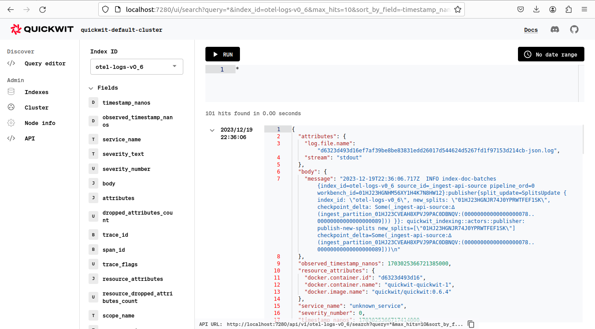

To send Docker container logs to Quickwit, you just need to set up an OpenTelemetry Collector with the file logs receiver. This tutorial will use `docker compose` to start the collector and Quickwit.

You only need a minute to get your Quickwit log UI!



## OTEL collector configuration

The following collector configuration will listen to RFC5424-compliant logs transmitted by Docker over TCP, parse them, and send them to Quickwit through gRPC at `http://quickwit:7281`.


```yaml title="otel-collector-config.yaml"
receivers:
  syslog:
    tcp:
      listen_address: 0.0.0.0:54526
    protocol: rfc5424
    operators:
      - id: extract_metadata_from_docker_tag
        parse_from: attributes.appname
        regex: 'docker/(?P<container_name>\w+)'
        type: regex_parser
        if: 'attributes?.appname != nil'

processors:
  batch:
    timeout: 5s

exporters:
  otlp:
    endpoint: quickwit:7281
    compression: none
    tls:
      insecure: true

service:
  pipelines:
    logs:
      receivers: [syslog]
      processors: [batch]
      exporters: [otlp]
```


## Start the OTEL collector and a Quickwit instance

Let's use `docker compose` with the following configuration:

The following boilerplate config includes a fragment that can be used to enable the syslog log-driver on docker-compose services.

The tag should be kept shorter than 32 printable US ASCII characters or parsing will fail. Docker will use the container tag to fill the appname and msgid fields of the syslog message as defined in RFC5424, the spec defines byte lengths for those fields.

``` yaml title="docker-compose.yaml"
version: '3.9'

# Use this configuration fragment to use docker's syslog log driver
x-syslog-logging: &logging
  driver: "syslog"
  options:
    tag: "docker/{{.Name}}"
    syslog-address: "tcp://127.0.0.1:54526"
    syslog-format: "rfc5424"

```

The snippet below ensures container networking behaves correctly on Linux for the collector to export to Quickwit.

``` yaml
networks:
  logging:
    name: logging
    ipam:
      driver: default
      config:
      - subnet: "192.168.32.0/20"
```

Here, you have both the collector and Quickwit services. Notice the use of the logging fragment and logging network on both containers.

``` yaml
services:
  otelcollector:
    container_name: otelcollector
    image: otel/opentelemetry-collector-contrib:${OTEL_VERSION:-0.87.0}
    ports:
      - 54526:54526/tcp  # Open this TCP port for the docker daemon to send logs to the collector
    volumes:
      - ./otel-collector-config.yaml:/etc/otel-collector/config.yaml
    command: ["--config=/etc/otel-collector/config.yaml"] 
    logging: *logging
    networks:
      logging:

  quickwit:
    container_name: quickwit
    image: 
    ports:
      - 7280:7280
      - 7281:7281
    volumes:
      - ./volumes/qwdata:/quickwit/qwdata
    environment:
      QW_ENABLE_OPENTELEMETRY_OTLP_EXPORTER: "true"
      OTEL_EXPORTER_OTLP_ENDPOINT: "http://localhost:7281"
    command: ["run"]
    logging: *logging
    networks:
      logging:
```

For good measure, let's add Grafana+Quickwit-datasource to the mix.

``` yaml
  grafana:
    container_name: grafana
    image: grafana/grafana-oss
    ports:
      - "3000:3000"
    environment:
      GF_INSTALL_PLUGINS: https://github.com/quickwit-oss/quickwit-datasource/releases/download/v0.3.0/quickwit-quickwit-datasource-0.3.0.zip;quickwit-quickwit-datasource
      GF_AUTH_DISABLE_LOGIN_FORM: "true"
      GF_AUTH_ANONYMOUS_ENABLED: "true"
      GF_AUTH_ANONYMOUS_ORG_ROLE: Admin
    volumes:
      - ./volumes/grafana:/var/lib/grafana
    logging: *logging
    networks:
      logging:
```

## Run it and search

Download the configuration files and start the containers:
   
```bash

mkdir -p volumes/qwdata volumes/grafana
docker compose up
```

After a few seconds, you will see the logs in the Quickwit UI [http://localhost:7280](http://localhost:7280).
