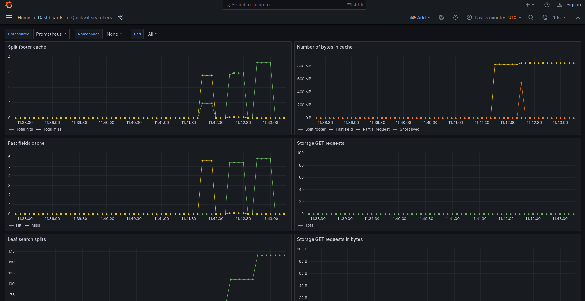

You can monitor your Quickwit cluster with Grafana.
Follow the tutorial at [Quickwit Monitoring with Grafana](../get-started/tutorials/prometheus-metrics) on how to set it up.

We provide three Grafana dashboards to help you monitor:
- [indexers performance](https://github.com/quickwit-oss/quickwit/blob/main/monitoring/grafana/dashboards/indexers.json)
- [searchers performance](https://github.com/quickwit-oss/quickwit/blob/main/monitoring/grafana/dashboards/searchers.json)
- [metastore queries](https://github.com/quickwit-oss/quickwit/blob/main/monitoring/grafana/dashboards/metastore.json)

Dashboards rely on a prometheus datasource fed with [Quickwit metrics](../reference/metrics.md).

## Screenshots

