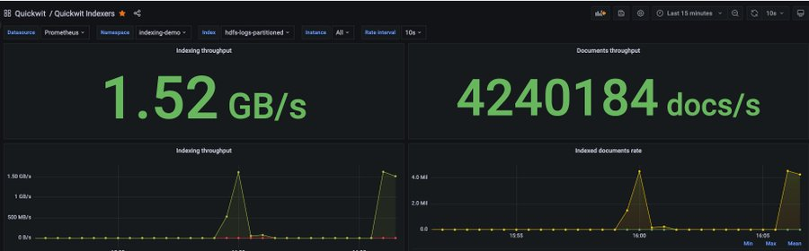
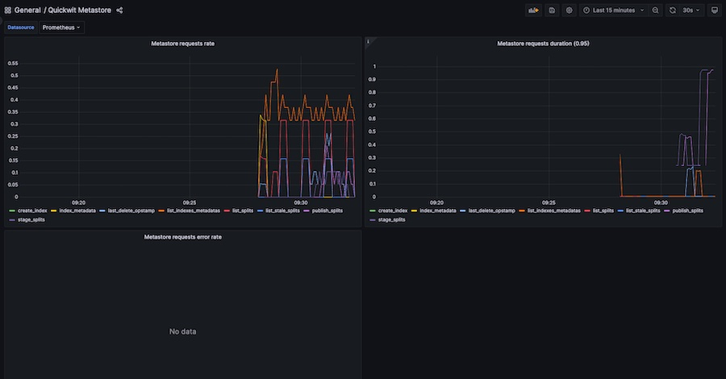

You can monitor your Quickwit cluster with Grafana.

We provide two Grafana dashboards to help you monitor:
- [indexers performance](https://github.com/quickwit-oss/quickwit/blob/main/monitoring/grafana/dashboards/indexer.json)
- [metastore queries](https://github.com/quickwit-oss/quickwit/blob/main/monitoring/grafana/dashboards/metastore.json)

Both dashboards relies on a prometheus datasource fed with [Quickwit metrics](../reference/metrics.md).

## Screenshots

