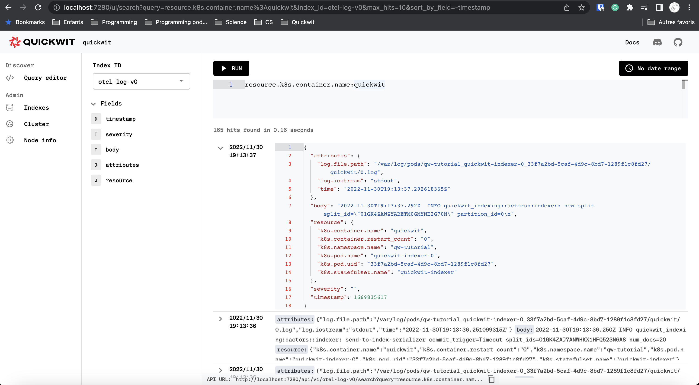

This guide will help you to unlock log search on your k8s cluster. We will first deploy Quickwit and OTEL collectors with Helm and then see how to index and search them.

:::warning

This tutorial uses Quickwit [Ingest API](/docs/reference/rest-api#ingest-data-into-an-index) which is not yet production ready and the OTEL gRPC endpoint which is currently experimental.

:::

## Prerequisites

You will need the following to complete this tutorial:
- A k8s cluster.
- The command line tool [kubectl](https://kubernetes.io/docs/reference/kubectl/).
- The command line tool [Helm](https://helm.sh/).
- An access to a shared storage like AWS S3, GCS, Azure blob storage, Scaleway, to store index data.


## Install with Helm

Let's first create a namespace to isolate our experiment and set it as the default namespace.

```bash
kubectl create namespace qw-tutorial
kubectl config set-context --current --namespace=qw-tutorial
```


Then let's add [Quickwit](https://github.com/quickwit-oss/helm-charts) and [Otel](https://github.com/open-telemetry/opentelemetry-helm-charts) helm repositories:

```bash
helm repo add quickwit https://helm.quickwit.io
helm repo add open-telemetry https://open-telemetry.github.io/opentelemetry-helm-charts
```

You should now see the two repos in helm:

```bash
helm repo list
NAME                	URL
quickwit            	https://helm.quickwit.io
open-telemetry      	https://open-telemetry.github.io/opentelemetry-helm-charts
```


### Deploy Quickwit

Let's create a basic chart configuration:

```bash
export AWS_REGION=us-east-1
export AWS_ACCESS_KEY_ID=XXXX
export AWS_SECRET_ACCESS_KEY=XXXX
export DEFAULT_INDEX_ROOT_URI=s3://your-bucket/indexes
```

```bash
# Create Quickwit config file.
echo "
searcher:
  replicaCount: 1
indexer:
  replicaCount: 1
metastore:
  replicaCount: 1
janitor:
  enabled: true

environment:
  # Remove ANSI colors.
  NO_COLOR: 1

# Quickwit configuration
config:
  # No metastore configuration.
  # By default, metadata is stored on the local disk of the metastore instance.
  # Everything will be lost after a metastore restart.
  s3:
    region: ${AWS_REGION}
    access_key: ${AWS_ACCESS_KEY_ID}
    secret_key: ${AWS_SECRET_ACCESS_KEY}
  default_index_root_uri: ${DEFAULT_INDEX_ROOT_URI}

  # Indexer settings
  indexer:
    # By activating the OTEL service, Quickwit will be able
    # to receive gRPC requests from OTEL collectors.
    enable_opentelemetry_otlp_service: true
" > qw-tutorial-values.yaml
```

Before installing Quickwit chart, make sure you have access to S3 and that you did not make a typo in the `default_index_root_uri`. This can be easily done with `aws` CLI with a simple `ls`:

```bash
aws s3 ls ${DEFAULT_INDEX_ROOT_URI}
```

If the CLI did not return an error, you are ready to install the chart:

```bash
helm install quickwit quickwit/quickwit -f qw-tutorial-values.yaml
```

After a few instant, you will see the pods running Quickwit services:

```bash
kubectl get pods
NAME                                 READY   STATUS    RESTARTS      AGE
quickwit-indexer-0                   1/1     Running   2 (25s ago)   37s
quickwit-janitor-79758cb7c7-5kvpr    0/1     Running   2 (36s ago)   37s
quickwit-metastore-6dc6f747f-fr4d6   1/1     Running   1 (36s ago)   37s
quickwit-searcher-0                  0/1     Running   2 (36s ago)   37s
```

Let's check Quickwit is working:

```bash
kubectl port-forward svc/quickwit-searcher 7280
```

Then open your browser `http://localhost:7280/ui/cluster`. You should see the cluster state in JSON :). If everything is fine, keep the kubectl command running and open a new terminal.

### Deploy OTEL collectors

We need to configure a bit the collectors in order to:
- collect logs from k8s
- enrich the logs with k8s attributes
- export the logs to Quickwit indexer.

```bash
echo "
mode: daemonset
presets:
  logsCollection:
    enabled: true
  kubernetesAttributes:
    enabled: true
config:
  exporters:
    otlp:
      endpoint: quickwit-indexer.qw-tutorial.svc.cluster.local:7281
      # Quickwit OTEL gRPC endpoint does not support compression yet.
      compression: none
      tls:
        insecure: true
  service:
    pipelines:
      logs:
        exporters:
          - otlp
" > otel-values.yaml
```

```
helm install otel-collector open-telemetry/opentelemetry-collector -f otel-values.yaml
```

## Create an OTEL index.

Quickwit is configured to receive OTEL logs on a specific index called `otel-log-v0`.
However it is not yet created in Quickwit metastore, let's do it. Here the OTEL schema in JSON, useful format for REST API. 

```json title=otel-index-config.json
{
  "version": "0.4",
  "index_id": "otel-log-v0",
  "doc_mapping": {
    "field_mappings": [
      {
        "name": "timestamp",
        "type": "datetime",
        "input_formats": [
          "unix_timestamp"
        ],
        "output_format": "unix_timestamp_secs",
        "fast": true
      },
      {
        "name": "severity",
        "type": "text",
        "tokenizer": "raw",
        "fast": true
      },
      {
        "name": "body",
        "type": "text",
        "tokenizer": "default",
        "record": "position"
      },
      {
        "name": "attributes",
        "type": "json"
      },
      {
        "name": "resource",
        "type": "json"
      }
    ],
    "timestamp_field": "timestamp"
  },
  "search_settings": {
    "default_search_fields": [
      "severity",
      "body"
    ]
  },
  "indexing_settings": {
    "commit_timeout_secs": 10
  }
}
```

We need to make a POST request that will hit a searcher instance which itself will call the metastore with a gRPC requests. 

```bash
curl -o otel-index-config.json https://raw.githubusercontent.com/quickwit-oss/quickwit/main/config/tutorials/otel-logs/otel-index-config.json
curl -XPOST http://127.0.0.1:7280/api/v1/indexes --data @otel-index-config.json -H "Content-Type: application/json"
```

The server will respond a 200 and returns the created index metadata (pretty much the same data you sent with some additional info). You can also view your fresh new index in the [Quickwit UI](http://localhost:7280/ui/indexes/otel-log-v0).

Unfortunately, Quickwit indexers needs to be restarted to start indexing, this will be fixed the next release.
In the meantime, you need to restart indexer, you can do it by executing the following command:

```
kubectl scale statefulset quickwit-indexer --replicas=0
# And then
kubectl scale statefulset quickwit-indexer --replicas=1
```

After 10 or 30 seconds, the indexer is up and running, let's have a look the logs to see that everything goes well.
```bash
kubectl logs quickwit-indexer-0 -f
```

You should see logs that look like these:
```
2022-11-30T18:27:37.628Z  INFO spawn_merge_pipeline{index=otel-log-v0 gen=0}: quickwit_indexing::actors::merge_pipeline: Spawning merge pipeline. index_id=otel-log-v0 source_id=_ingest-api-source pipeline_ord=0 root_dir=/quickwit/qwdata/indexing/otel-log-v0/_ingest-api-source merge_policy=StableLogMergePolicy { config: StableLogMergePolicyConfig { min_level_num_docs: 100000, merge_factor: 10, max_merge_factor: 12, maturation_period: 172800s }, split_num_docs_target: 10000000 }
2022-11-30T18:27:37.628Z  INFO quickwit_serve::grpc: Starting gRPC server. enabled_grpc_services={"otlp-log", "otlp-trace"} grpc_listen_addr=0.0.0.0:7281
2022-11-30T18:27:37.628Z  INFO quickwit_serve::rest: Starting REST server. rest_listen_addr=0.0.0.0:7280
2022-11-30T18:27:37.628Z  INFO quickwit_serve::rest: Searcher ready to accept requests at http://0.0.0.0:7280/
2022-11-30T18:27:42.654Z  INFO quickwit_indexing::actors::indexer: new-split split_id="01GK4WPTXK8GH3AGTRNBN9A8YG" partition_id=0
2022-11-30T18:27:52.643Z  INFO quickwit_indexing::actors::indexer: send-to-index-serializer commit_trigger=Timeout split_ids=01GK4WPTXK8GH3AGTRNBN9A8YG num_docs=22
2022-11-30T18:27:52.652Z  INFO index_batch{index_id=otel-log-v0 source_id=_ingest-api-source pipeline_ord=0}:packager: quickwit_indexing::actors::packager: start-packaging-splits split_ids=["01GK4WPTXK8GH3AGTRNBN9A8YG"]
2022-11-30T18:27:52.652Z  INFO index_batch{index_id=otel-log-v0 source_id=_ingest-api-source pipeline_ord=0}:packager: quickwit_indexing::actors::packager: create-packaged-split split_id="01GK4WPTXK8GH3AGTRNBN9A8YG"
2022-11-30T18:27:52.653Z  INFO index_batch{index_id=otel-log-v0 source_id=_ingest-api-source pipeline_ord=0}:uploader: quickwit_indexing::actors::uploader: start-stage-and-store-splits split_ids=["01GK4WPTXK8GH3AGTRNBN9A8YG"]
2022-11-30T18:27:52.733Z  INFO index_batch{index_id=otel-log-v0 source_id=_ingest-api-source pipeline_ord=0}:uploader:stage_and_upload{split=01GK4WPTXK8GH3AGTRNBN9A8YG}:store_split: quickwit_indexing::split_store::indexing_split_store: store-split-remote-success split_size_in_megabytes=0.018351 num_docs=22 elapsed_secs=0.07654519 throughput_mb_s=0.23974074 is_mature=false
```

If you see some errors there, it's probably coming from a misconfiguration of your object storage. If you need some help, please open an issue on [GitHub](https://github.com/quickwit-oss/quickwit) or come on our [discord server](https://discord.gg/MT27AG5EVE).  


### Ready to search logs

You are now ready to search: just [open the UI](http://localhost:7280/ui/search?query=*&index_id=otel-log-v0&max_hits=10&sort_by_field=-timestamp) and play with it. Funny thing you will see quickwit logs in it :).

Example of queries:

- [quickwit](http://localhost:7280/ui/search?query=quickwit&index_id=otel-log-v0&max_hits=10&sort_by_field=-timestamp)
- [resource.k8s.container.name:quickwit](http://localhost:7280/ui/search?query=resource.k8s.container.name%3Aquickwit&index_id=otel-log-v0&max_hits=10&sort_by_field=-timestamp)
- [resource.k8s.container.restart_count:1](http://localhost:7280/ui/search?query=resource.k8s.container.restart_count%3A1&index_id=otel-log-v0&max_hits=10&sort_by_field=-timestamp)

 


And that's all folks!

### Clean up

Let's first delete the index and then uninstall the charts.

```bash
# Delete the index. The command will return the list of delete split files.
curl -XDELETE http://127.0.0.1:7280/api/v1/indexes/otel-log-v0

# Uninstall charts
helm uninstall otel-collector
helm uninstall quickwit

# Delete namespace
kubectl delete namespace qw-tutorial
```
