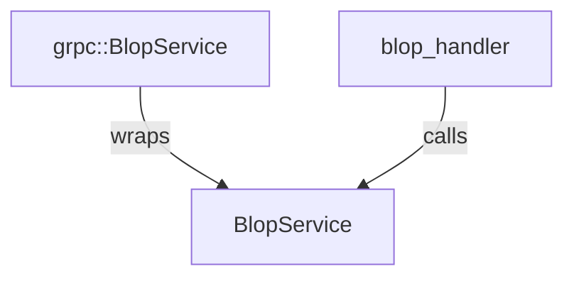

# quickwit-serve

This project hosts the REST and the gRPC API associated with quickwit.

The API is split into
- the search api: the normal and the stream search api.
- the cluster api: expose information about the cluster, its members etc.
- the health check api: the health check of the current node. This API is rest only at the moment.

The APIs are usually accessible both via gRPC and REST.
This is done consistently using the following pattern.

A service async trait mimicks the tonic service api, but without the `tonic`
wrapping of the request and with a rich and specific error type instead of tonic::Status.
The argument and the response on the other hand are typically using protobuf object
directly whenever sensible.

This service only has one implementation but is a trait for mocking purpose.
This service is typically exposed by another crate, specific to the API considered.
For instance, the search api has a `SearchService` trait, using the `SearchError`
response in the `quickwit-search` crate.

An adapter then wraps this service to implement the grpc::Service
(It simply does the wrapping of the request / results and converts errors to the tonic status.).

The rest API then relies on calling this service.

