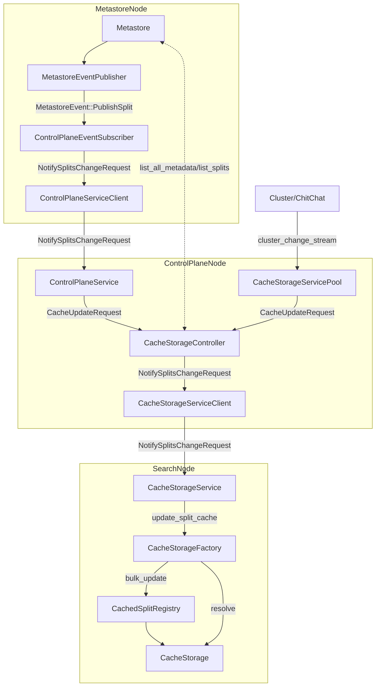

# Cache Storage

Cache Storage provides a local storage cache for a subset of splits. The high-level interactions between components responsible for the local storage cache are depicted in the following diagram:

The allocation of splits is controlled by the CacheStorageController that resides on the control plane nodes and receives notifications about newly published splits from the `Metastore` via `ControlPlaneService` as well as information about available search nodes from `Cluster` via cluster change stream.

On each notification the `CacheStorageController` requests a list of all indices. It then iterates through this list requesting available splits and allocating them to available nodes for caching (Search nodes that have cache configured).

All nodes that had their list of cached splits changed are getting notified via `NotifySplitsChangeRequest` that contains a full list of splits that that node is supposed to have allocated locally.

On the search nodes the `NotifySplitsChangeRequest` is handled by `CacheStorageService` that discovers the local `CacheStorageFactory` and notifies it about the changes. The `CacheStorageFactory` maintains a list of splits allocated locally, performs split downloads and clean up in `CachedSplitRegistry`. The `CacheStorageFactory` also makes the `CachedSplitRegistry` available to `CacheStorage`. For all read requests the `CacheStorage` checks if splits are available in the `CachedSplitRegistry` and services them from the local cache if possible.
