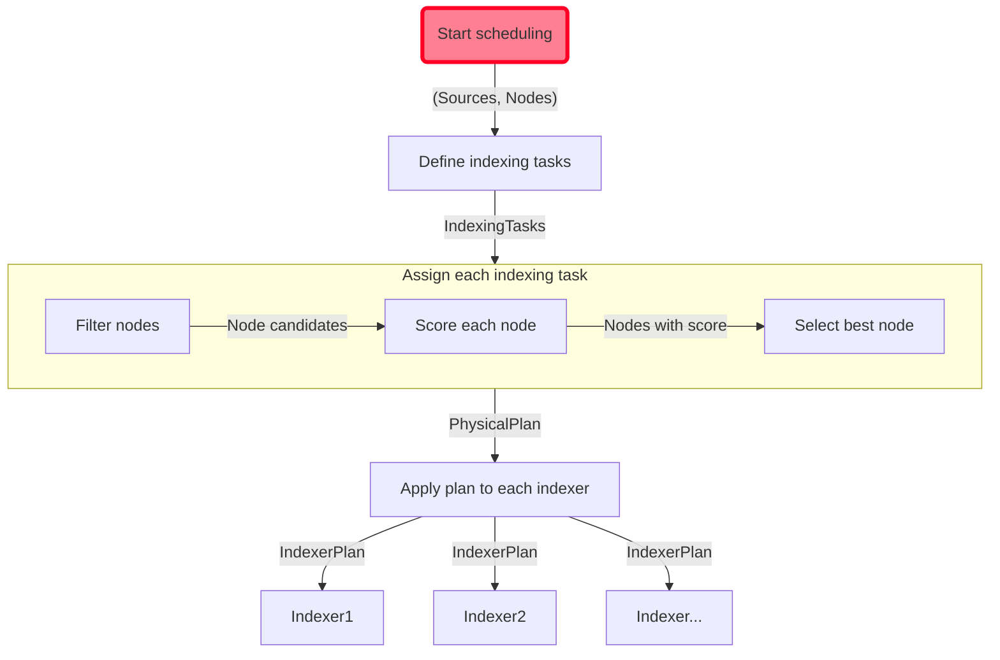

# Quickwit Control Plane

The Control Plane is responsible for scheduling indexing tasks to indexers.
It suscribes to all metastore events to keep an up to date view of the list of tasks that should be running on the cluster.
An indexing task is simply identified by a couple `(IndexId, SourceId)`.

Its role is to ensure that the cluster is correctly running all indexing tasks, each on single node.

On startup, or when a metastore event is received, it computes the list of
indexing tasks.
It then applies a placement algorithm to decide which node should be running each indexing task. The result of this placement is called the physical indexing plan, and associated each node to a list of indexing task.

The control plane then emits gRPC to the nodes that are not already following their assigned part of the indexing plan.

All nodes report their currently running plan via chitchat.
A control loop makes sure that this cluster state matches the currently adopted plan.
If a divergence is observed (for instance, if a node leaves the cluster), or if a node node reports not being running a given pipeline, the control plane will take the necessary actions. (respectively recompute the physical plan or reapply the plan).

