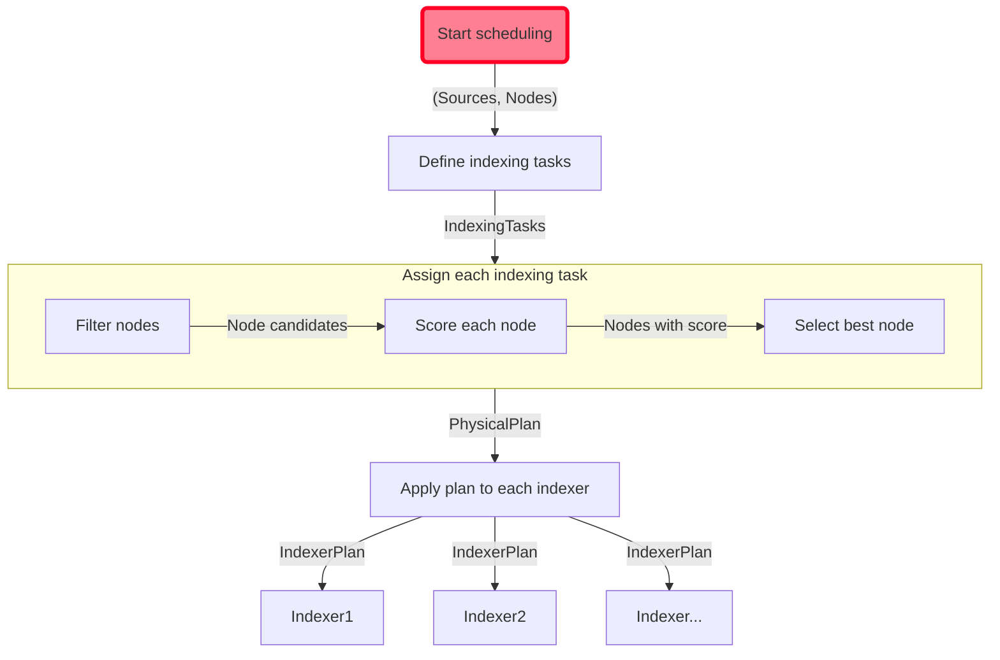

# Quickwit Control Plane

The Control Plane is responsible for scheduling indexing tasks to indexers.

```mermaid
flowchart TB
    StartScheduling(Start scheduling)--"(Sources, Nodes)"-->Define
    style StartScheduling fill:#ff0026,fill-opacity:0.5,stroke:#ff0026,stroke-width:4px
    Define[Define indexing tasks] --IndexingTasks--> AssignTasks
    subgraph AssignTasks[Assign each indexing task]
    direction LR
    Filter[Filter nodes]--Node candidates-->Score
    Score[Score each node]--Nodes with score-->Select[Select best node]
    end
    AssignTasks--PhysicalPlan-->Apply
    Apply[Apply plan to each indexer] --IndexerPlan--> Indexer1
    Apply --IndexerPlan--> Indexer2
    Apply --IndexerPlan--> Indexer...
```
