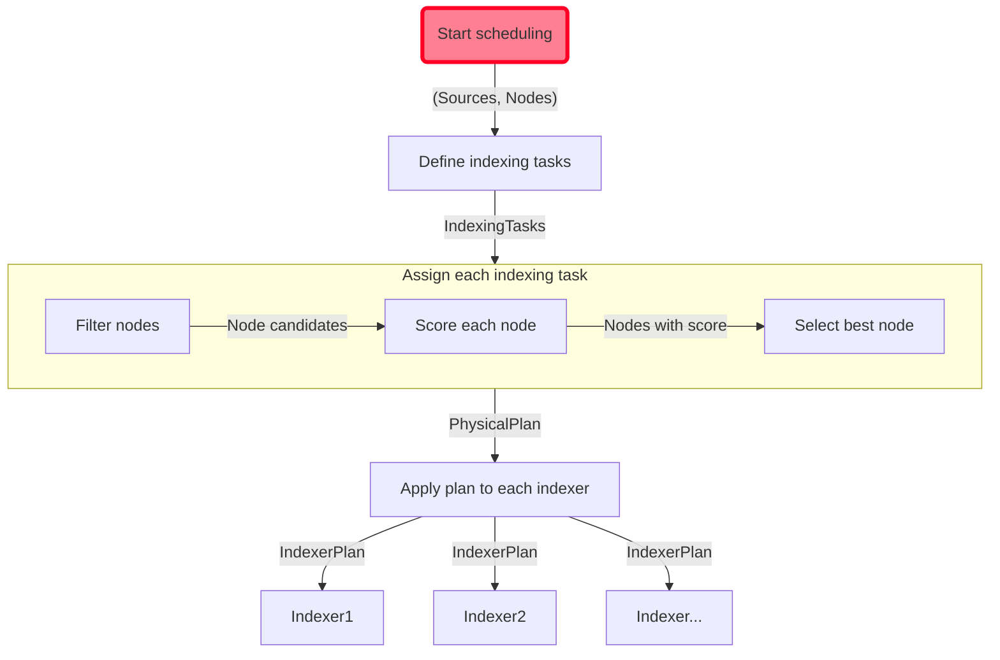

# Quickwit Control Plane

The Control Plane is responsible for scheduling indexing tasks to indexers. Its role is to ensure that the cluster is correctly running all indexing tasks on each indexer.

An indexing task is simply identified by a couple `(IndexId, SourceId)`.

## Scheduling algorithm

The control plane subscribes to all metastore events to keep an up to date the list of indexing tasks that should be running on the cluster.

On startup, or when a metastore event is received, the scheduler computes the list of indexing tasks.
It then applies a placement algorithm to decide which indexer should be running each indexing task. The result of this placement is called the physical indexing plan, and associated each indexer to a list of indexing tasks.

The control plane then emits gRPC to the indexers that are not already following their assigned part of the indexing plan.

## Control loop

Each indexer reports its currently running plan via chitchat.
A control loop makes sure that this cluster state matches the latest applied plan.
If a divergence is observed (for instance, if a node leaves the cluster), or if a node reports not being running a given pipeline, the control plane will take the necessary actions (respectively recompute the physical plan or reapply the plan).

## Read more in the Rust docs

[Scheduler Rust docs](./src/scheduler.rs#L66)
