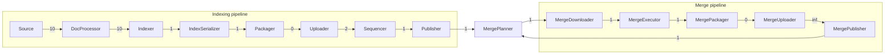

```mermaid
flowchart LR
    subgraph Indexing pipeline
        direction LR
        source[Source] --10--> doc_processor
        doc_processor[DocProcessor] --10--> indexer
        indexer[Indexer] --1--> serializer
        serializer[IndexSerializer] --1--> packager
        packager[Packager] --0--> uploader
        uploader[Uploader] --2--> sequencer
        sequencer[Sequencer] --1--> publisher
    end
    subgraph Merge pipeline
        direction LR
        merge_downloader[MergeDownloader] --1--> merge_executor
        merge_executor[MergeExecutor] --1--> merge_packager
        merge_packager[MergePackager] --0--> merge_uploader
        merge_uploader[MergeUploader] --inf--> merge_publisher
    end
    merge_planner[MergePlanner] --1--> merge_downloader
    merge_publisher[MergePublisher] --1--> merge_planner
    publisher[Publisher] --1--> merge_planner
```
