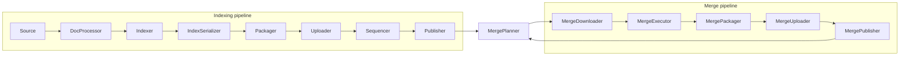

```mermaid
flowchart LR
    subgraph Indexing pipeline
        direction LR
        source[Source] --> doc_processor
        doc_processor[DocProcessor] --> indexer
        indexer[Indexer] --> serializer
        serializer[IndexSerializer] --> packager
        packager[Packager] --> uploader
        uploader[Uploader] --> sequencer
        sequencer[Sequencer] --> publisher
    end
    subgraph Merge pipeline
        direction LR
        merge_downloader[MergeDownloader] --> merge_executor
        merge_executor[MergeExecutor] --> merge_packager
        merge_packager[MergePackager] --> merge_uploader
        merge_uploader[MergeUploader] --> merge_publisher
    end
    merge_planner[MergePlanner] --> merge_downloader
    merge_publisher[MergePublisher] --> merge_planner
    publisher[Publisher] --> merge_planner
```
