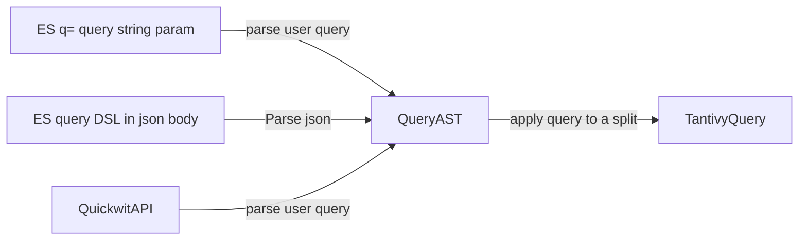

Quickwit



In quickwit and tantivy, we call XXXQuery every object representing a predicate over a document, hence selecting a subset of documents.

Such objects do not contain information about what to do with the document, for instance, how to sort them, which aggregation to run on them, etc.

The `SearchRequest` object, on the other hand, is the larger object in charge of gathering all of the information of the request, including the user query.

Quickwit uses a `QueryAST` object to represent queries internally.
Regardless of how the query has been supplied (ES-compatible API, quickwit search API,  search stream API), we convert
it to a QueryAST. Because it is schema agnostic, it can be serialized and passed around.

# root / leaf

One confusing thing about the QueryAST is that because we want its construction to not depend on
the docmapper: building the QueryAST should not require interrogating the metastore. It
is built without knowing the default fields of the index.

For this reason, the AST contains a node called `UserInputQuery` that has a bit of special status:
before usage, the AST must parse the content of these nodes and replace them by an AST.

This operation is done on the root search (on which the doc mapper, and hence the default fields are known),
and dispatched to the leaf search.
The root search checks the validity of the search against *against the current DocMapper*.

That way we are able to return an error to the user, if for instance the query includes a range query that does not target a fast field.

The leaf search is applied on splits that may have been produced with a different doc mapper.
Considering our example again, we want users to be able to run range query after they updated their schema.

Reindexing is not option in quickwit, so what will happen is generally speaking a best effort solution.
The range query node of the AST will act as if it was a match nothing node, and the recall will be affected for these
legacy splits.
Generally, this behavior decreases recall, but `MUST NOT` clauses can actually increase recall.

# Elasticsearch compatibility API

The user's request contains information in both the http body and the querystring parameters. These parameters may overlap, in which case the querystring parameter takes priority.

In the body, a user can supply the query using a rich query DSL expressed in JSON format.
```json
{
    "query": { /* ESQueryDSL */}
}
```

When the query is passed as an `ESQueryDSL`, it is simply deserialized into a `QueryAST` object. The `QueryAST is` a one-to-one representation of the user input. It is entirely schema-agnostic.

