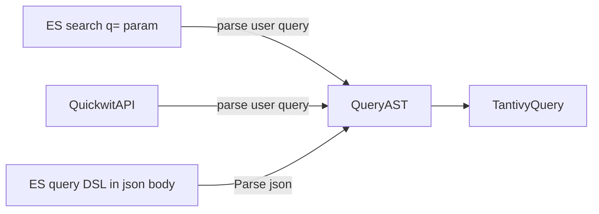

Quickwit




In quickwit and in tantivy, we call Query every object that represent a predicate over a document, hence selecting a subset of documents.
It does not contain information about what to do with the document, for instance how to sort them, which aggregation to run on them etc.

The SearchRequest is the larger object in charge of gathering all of the information of the request, included the user query.

Quickwit uses a `QueryAST` object to represent queries internally.
Regardless of how the query has been supplied, the

Following the query transformation when receving an elastic query.

The user request contains information in both the body of the request and in the search parameter. querystring parameters and via the body of the query. These parameter may overlap strongly, in which case the querystring parameter takes priority.

In the body, a user can supply the query using a rich query DSL expressed in JSON format.
```json
{
    "query": { /* ESQueryDSL */}
}
```

When the query is passed as a ESQueryDSL it is simply deserialized into a QueryDSL object. The QueryDSL is a one-one representation of the user input. It is entirely schema agnostic.

That object is then transformed into a QueryAST.
This operation involves some information form the docmapper, but the QueryAST should be relatively independent from the schema.

In particular,
- strings are not be tokenized. Parsing should be left to the leaf code and should be specific to splits themselves. This has the downside of adding discrepancy in the results, but has the merit of at least "working" as opposed to return 0 results.
- the QueryAST refer to fields by their field name.

On the other hand, if default fields are necessary, the default fields from the last version fo the docmapper will be used.

It is then possible to build a tantivy query from the `QueryAST`, given a specific schema.

This operation involves tokenization and field name to field resolution.

